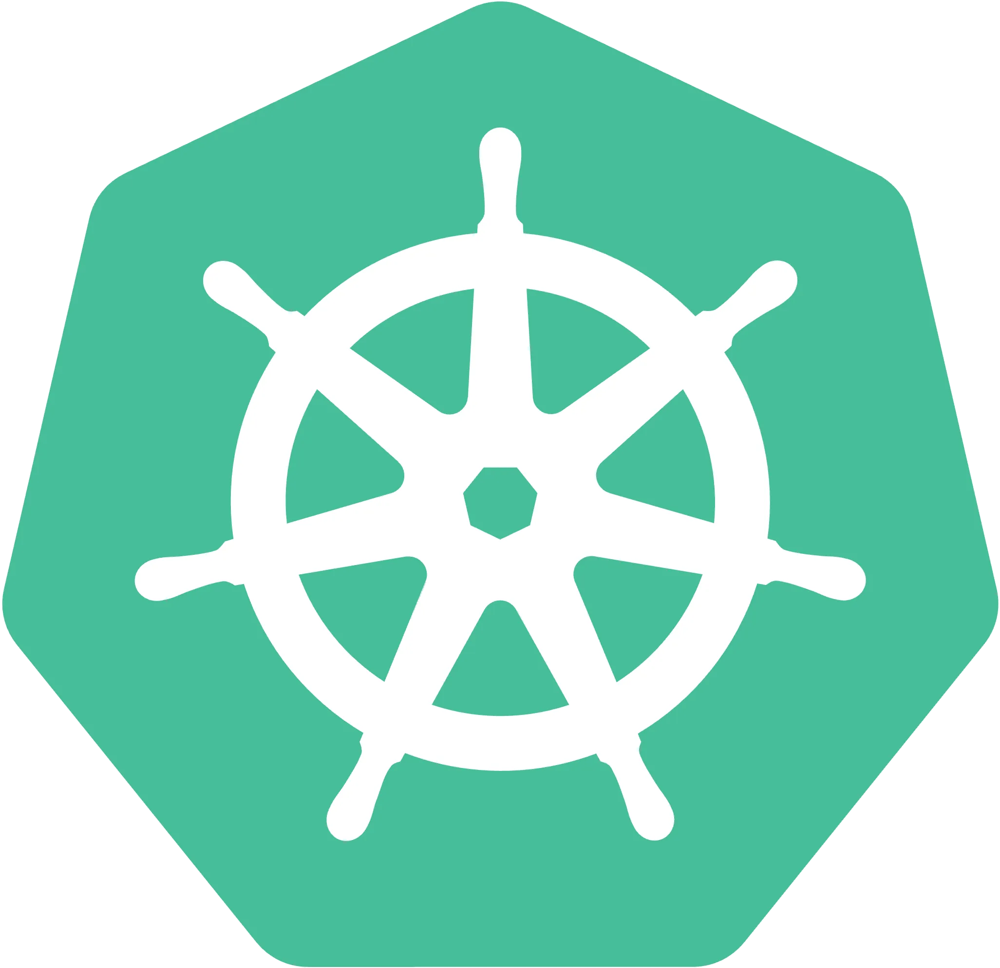

<!--
    Actually, the `align` attribute on `p` or `h1` elements is deprecated [1].
    But who cares? It works nicely! :D

    [1]: https://html.spec.whatwg.org/multipage/obsolete.html#non-conforming-features
-->

    
    <h1 align="center">PKS 공식 문서</h1>

PKS (Poolc Kubernetes Service)는 PoolC 동아리원을 위한 내부 쿠버네티스 서비스입니다.

PKS는 2024년 11월 30일, PoolC 홈커밍 행사 중 최유찬 회원과 양정일(@jjungs7) 회원의 비공식적인 대화에서 출발했습니다. 이후 양정일 회원과 양제성(@J3m3) 회원 간의 논의를 기점으로 초기 구상이 구체화되기 시작했고, 진영민(@jimmy0006) 회원이 합류하면서 개발이 본격화되었습니다. 초기 기여자 여러분들께 감사드립니다!

## 문서 모음

- [사용자 가이드](https://github.com/PoolC/PKS-docs/tree/main/docs/user-guides)
- [운영자 가이드](./docs/admin-guide.md)
- [PKS에 기여하기](./docs/contributing.md)
- [아키텍처 개요](./docs/architecture.md)
- [하드웨어 스펙](./docs/hw-spec.md)
- [TODO list](./docs/todo.md)

## 개발 취지

PKS는 다음과 같은 고민에서 시작됐습니다.

> "동아리원이 함께 쓸 수 있는 공용 개발 서버가 있었으면 좋겠다..."
>
> "쿠버네티스를 써보고 싶은데... 로컬에서 간단히 돌려보는 걸로는 뭔가 아쉽다..."
>
> "서버나 네트워크, 늘 이론으로만 배우지 실제로 만져볼 일은 잘 없네..."

이러한 고민들은 자연스럽게 하나의 방향으로 이어졌습니다.

> "씁... 없으면 만들면 되는 거 아닌가?"

이렇게 PKS는 동아리원이 함께 실습하고, 배포하고, 운영해볼 수 있는 쿠버네티스 기반의 공용 인프라를 구축하려는 시도에서 출발했습니다. 거창하게 여러 말을 붙였지만, 결국 PKS의 목표는 단순합니다.

**_"동아리원이 안심하고 터뜨려도 되는, 마음껏 갖고 놀 수 있는 장난감."_**

## 관련 레포지토리

- PKS 세미나: TBD
- [PKS Credentials Updater](https://github.com/PoolC/pks-credentials-updater): PKS 클러스터의 유저 정보를 일정 주기로 PoolC API 서버와 동기화하는 어플리케이션
- [PKS Bootstrapping](https://github.com/PoolC/pks-bootstrapping): PKS 클러스터 부트스트래핑을 위한 manifest 모음

## Special Thanks To

- 최진호(@jinhodotchoi) 회원: PKS 클러스터 이용 편의성 향상을 위한 PoolC 홈페이지 인터페이스 구축
