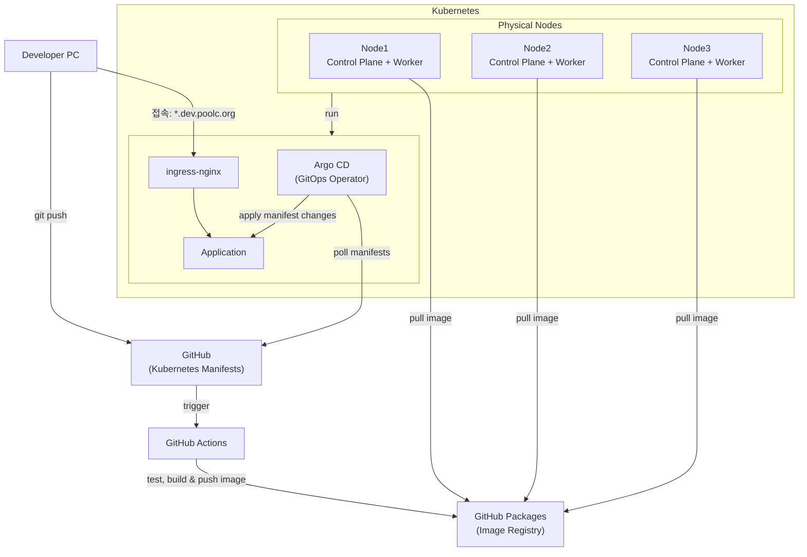

# 아키텍쳐 개요

## 시스템 아키텍처

```mermaid
flowchart TB
  Actions["GitHub Actions"]
  Registry["GitHub Packages<br />(Image Registry)"]

  Dev["Developer PC"]
  Git["GitHub<br/>(Kubernetes Manifests)"]

  subgraph "Kubernetes"
    direction TB

    subgraph Services[" "]
	    direction TB
      ArgoCD["Argo CD<br/>(GitOps Operator)"]
      Ingress["ingress-nginx"]
      AppSvc["Application"]
    end

	  subgraph PhysicalNodes["Physical Nodes"]
	    direction TB
	    Node1["Node1<br/>Control Plane + Worker"]
	    Node2["Node2<br/>Control Plane + Worker"]
	    Node3["Node3<br/>Control Plane + Worker"]
	  end
	end

  PhysicalNodes -->|run| Services

  Git -->|trigger| Actions
  Actions -->|test, build & push image| Registry

  Dev -->|git push| Git

  ArgoCD --->|poll manifests| Git

  Dev -->|접속: *.dev.poolc.org| Ingress
  Ingress --> AppSvc

  ArgoCD -->|apply manifest changes| AppSvc
  Node1 -->|pull image| Registry
  Node2 -->|pull image| Registry
  Node3 -->|pull image| Registry
```
