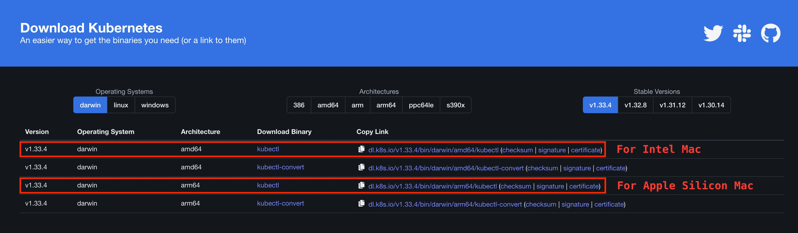

# 사용자 가이드

## Quick? Start

### 1. `kubectl` 바이너리 설치

CLI 명령어 도구인 `kubectl`를 이용해 PKS 클러스터에 접근할 수 있습니다. `kubectl` 바이너리는
[downloadkubernetes.com](https://www.downloadkubernetes.com/)에서 다운로드받을 수 있습니다.

<figure align="center">
    <!-- TODO: 이미지 에셋 디렉토리 구조 변경 -->
    
    <figcaption>Mac에서 바이너리를 다운로드받는 예시</figcaption>
</figure>

패키지 매니저를 이용한 방식을 선호하시거나 더 자세한 내용을 원하시는 경우,
[쿠버네티스 공식 문서](https://kubernetes.io/docs/tasks/tools/#kubectl)를 참조해주세요.

### 2. kubeconfig 파일 셋업

- TODO
  - 풀씨 홈페이지 업데이트 이후, 스크린샷에 주석을 추가하는 방식으로 사용 방법 가이드
    - 해당 페이지에서 복사하는 명령어들은 CA 인증서를 사용하지 않도록 설정? [하단 예시 참조]

```
kubectl config set-credentials pks \
  --token=<JWT>

kubectl config set-cluster pks \
  --server="https://165.132.131.121:6443" \
  --insecure-skip-tls-verify=true

kubectl config set-context pks\
  --cluster=pks \
  --user=pks

kubectl config use-context pks
```

### 3. 클러스터 접속 테스트

정상적으로 설정이 완료되었다면, 아래 명령어가 오류 없이 실행되어야 합니다.

```console
$ kubectl get namespaces
NAME                 STATUS   AGE
argocd               Active   62d
cilium-secrets       Active   79d
default              Active   79d
ingress-nginx        Active   78d
kube-node-lease      Active   79d
kube-public          Active   79d
kube-system          Active   79d
kyverno              Active   13d
local-path-storage   Active   18d
monitoring           Active   74d
pks-argocd-demo      Active   11d
poolc-system         Active   13d
poolc-users          Active   33h
```

### 4. (Optional) CA 인증서 설정

`kubectl` CLI 도구는 HTTPS를 통해 PKS 클러스터의 API 서버와 통신합니다. 해당 과정에서 API 서버의 디지털 인증서를 검증하기 위해서는, PKS 클러스터의 self-signed CA 인증서가 필요합니다. self-signed CA 인증서는
[PKS-docs 레포지토리](/ca.crt)에서 다운로드받을 수 있습니다.

이후 아래 명령어로 kubeconfig 파일을 업데이트하여 `kubectl`이 해당 CA 인증서를 사용하도록 설정할 수 있습니다.

```bash
kubectl config set-cluster pks \
  --server="https://165.132.131.121:6443" \
  --embed-certs=true \
  --certificate-authority=<path/to/ca.crt>
```
