# Argo CD를 활용해 [GitOps](#gitops와-argo-cd) 기반의 개발 프로세스 확립하기

이 문서는 [Argo CD](#gitops와-argo-cd)를 활용해 PKS에 `git push`만으로 애플리케이션을 배포하는 예시를
다룹니다.

## 목차

- [Motivation](#motivation)
- [Quick Start](#quick-start)
  - [Step 1. GitHub 레포지토리 생성](#step-1-github-레포지토리-생성)
  - [Step 2. 애플리케이션 코드 작성](#step-2-애플리케이션-코드-작성)
  - [Step 3. Dockerfile 작성](#step-3-dockerfile-작성)
  - [Step 4. Kubernetes manifest 작성](#step-4-kubernetes-manifest-작성)
  - [Step 5. GitHub Actions workflow 작성](#step-5-github-actions-workflow-작성)
  - [Step 6. Workflow 실행 결과 확인](#step-6-workflow-실행-결과-확인)
  - [Step 7. Argo CD에 GitHub 레포지토리 등록](#step-7-argo-cd에-github-레포지토리-등록)
  - [Step 8. CI/CD 파이프라인 테스트](#step-8-cicd-파이프라인-테스트)
  - [Step 9. 실습 완료 후 모든 자원 삭제하기](#step-9-실습-완료-후-모든-자원-삭제하기)
- [부록](#부록)
  - [전체 실습 실행 결과물](#전체-실습-실행-결과물)
  - [GitOps와 Argo CD](#gitops와-argo-cd)
  - [Argo CD의 Application manifest](#argo-cd의-application-manifest)
  - [GitHub Actions가 무엇인가요?](#github-actions가-무엇인가요)

## Motivation

Argo CD를 사용하면, 아래의 일반적인 수동 배포 프로세스를 `git push` 한 단계로 단축시킬 수 있습니다.

1. Git 레포지토리에 애플리케이션 코드 `git push`
2. 컨테이너 이미지 빌드
3. 필요한 경우 빌드된 이미지를 이미지 레지스트리에 업로드
4. 배포 서버에서 해당 이미지로 컨테이너 실행

매번 코드를 업데이트할 때마다 이 모든 과정을 거치기는 번거롭습니다. Argo CD는 이러한 워크플로우를 단순화하기 위한
도구입니다.

## Quick Start

> [!IMPORTANT]
> 사용자 가이드 [README](./README.md)의 모든 설정을 마친 이후에 아래 가이드를 따라와 주세요. 특히 YSVPN이
> 활성화되어 있어야 합니다!

이 실습에서는 아래의 도구들을 활용해 배포 프로세스를 자동화합니다.

| Component                  | Tool                               |
| -------------------------- | ---------------------------------- |
| Git repository             | GitHub                             |
| CI(Continuous Integration) | GitHub Actions                     |
| CD(Continuous Deployment)  | Argo CD                            |
| Container image registry   | GitHub Packages Container Registry |

> [!CAUTION]
> Windows CMD, Powershell 환경의 경우 일부 스크립들이 제대로 동작하지 않습니다. Git bash를 이용하시거나,
> WSL 환경에서 작업하시길 권장드립니다.

### Step 1. GitHub 레포지토리 생성

애플리케이션 코드가 관리될 GitHub 레포지토리를 생성합니다.
[https://github.com/new](https://github.com/new)에 접속해서 빈 public 레포지토리를 생성해주세요.

> [!NOTE]
> 현재 PKS의 CD 시스템은 private repository를 지원하지 않습니다. PKS는 개발 취지상, 동아리원이 서로의
> 작업물을 공유하며 함께 배우는 것을 지향하기 때문입니다.

이후 아래 명령어를 참조해 로컬 환경의 작업 디렉토리를 생성해주세요.

```bash
cd <ANY_EMPTY_DIRECTORY_YOU_WANT>
git init
git branch -M main
git remote add origin <URL_TO_YOUR_NEW_GITHUB_REPOSITORY>
```

### Step 2. 애플리케이션 코드 작성

아래 명령어를 실행해 간단한 Python 기반 웹 서버 애플리케이션을 생성해주세요.

```bash
mkdir app

cat <<EOF > app/server.py
from http.server import HTTPServer, SimpleHTTPRequestHandler

class CustomHandler(SimpleHTTPRequestHandler):
    def do_GET(self):
        if self.path == "/":
            try:
                with open("./index.html", "rb") as file:
                    self.send_response(200)
                    self.send_header("Content-type", "text/html")
                    self.end_headers()
                    self.wfile.write(file.read())
            except FileNotFoundError:
                self.send_error(404, "File not found")
        else:
            self.send_error(404, "File not found")

if __name__ == "__main__":
    port = 8080
    server_address = ("0.0.0.0", port)
    httpd = HTTPServer(server_address, CustomHandler)
    print(f"Serving on port {port}")
    httpd.serve_forever()
EOF

cat <<EOF > app/index.html
<!DOCTYPE html>
<html lang="en">
  <head>
    <meta charset="UTF-8" />
    <meta name="viewport" content="width=device-width, initial-scale=1.0" />
    <title>PKS Argo CD demo</title>
  </head>
  <body>
    <h1>Hello, world!</h1>
  </body>
</html>
EOF

git add -A
git commit -m "feat: add simple web server"
```

### Step 3. Dockerfile 작성

아래 명령어를 실행해 애플리케이션 패키징을 위한 Dockerfile을 생성해주세요.

```bash
cat <<EOF > Dockerfile
FROM gcr.io/distroless/python3
COPY /app /app
WORKDIR /app
CMD ["server.py"]
EOF

git add -A
git commit -m "build: add Dockerfile"
```

### Step 4. Kubernetes manifest 작성

이제 Python 웹 서버 애플리케이션의 배포를 위한 Kubernetes manifest 파일을 생성해야 합니다.

1. 하단의 스크립트 내용을 복사한 후, 사용하는 텍스트 에디터에 붙여넣어주세요.
2. `SUBDOMAIN_NAME`을 원하는 값으로 수정해주세요.
   - 예시: pks-argocd-demo
   - 참조: [서브도메인이 무엇인가요?](./PKS-101.md#서브도메인이-무엇인가요)
3. 수정된 스크립트를 로컬 터미널에 그대로 복사 & 붙여넣기해 실행해주세요.

> [!NOTE]
> PKS에 배포되는 워크로드들은 dev.poolc.org 하위의 서브도메인을 **서로 겹치지 않는 선에서** 자유롭게 사용
> 가능합니다. `kubectl get ingress --all-namespaces` 명령어를 통해 현재 사용 중인 도메인을 확인하고, 겹치지
> 않는 서브도메인을 사용해주세요.

```bash
SUBDOMAIN_NAME="UNIQUE_STRING_WITH_LOWERCASE_ALPHABET_OR_HYPHEN"

mkdir manifests

cat <<EOF > manifests/deployment.yaml
apiVersion: apps/v1
kind: Deployment
metadata:
  name: demo-server
spec:
  replicas: 1
  selector:
    matchLabels:
      app: demo-server
  template:
    metadata:
      labels:
        app: demo-server
    spec:
      containers:
        - name: demo-server
          image: PLACEHOLDER
          ports:
            - name: http
              containerPort: 8080
          resources:
            requests:
              memory: 64Mi
              cpu: 100m
            limits:
              memory: 64Mi
              cpu: 100m
EOF

cat <<EOF > manifests/service.yaml
apiVersion: v1
kind: Service
metadata:
  name: demo-server
spec:
  type: ClusterIP
  ports:
    - port: 8080
      targetPort: http
  selector:
    app: demo-server
EOF

cat <<EOF > manifests/ingress.yaml
apiVersion: networking.k8s.io/v1
kind: Ingress
metadata:
  name: demo-server
  annotations:
    nginx.ingress.kubernetes.io/backend-protocol: HTTP
spec:
  ingressClassName: nginx
  rules:
    - host: $SUBDOMAIN_NAME.dev.poolc.org
      http:
        paths:
          - path: /
            pathType: Prefix
            backend:
              service:
                name: demo-server
                port:
                  number: 8080
EOF

git add -A
git commit -m "chore(cd): add k8s manifests"
```

### Step 5. GitHub Actions workflow 작성

아래 명령어를 통해 [GitHub Actions workflow](#github-actions가-무엇인가요) YAML 파일을 생성해주세요.
해당 workflow는 대략 아래와 같이 동작합니다.

1. "main" 브랜치에 대한 `git push` 이벤트 감지
2. Dockerfile을 통해 컨테이너 이미지 빌드
3. 해당 컨테이너 이미지를 GitHub Packages Container Registry에 업로드
4. 해당 컨테이너 이미지의 reference(ghcr.io/\<repository-name>:\<tag>) 추출
5. `manifests/deployment.yaml`의 `.spec.template.spec.containers[0].image` 필드 값을
   해당 reference로 업데이트
6. `manifests/deployment.yaml`의 변경사항을 GitHub 레포지토리에 `git push`

```bash
mkdir -p .github/workflows

cat <<'EOF' > .github/workflows/ci+cd.yaml
name: CI/CD - Push Image & Update Manifests

# https://docs.github.com/en/actions/reference/workflows-and-actions/workflow-syntax#onpushpull_requestpull_request_targetpathspaths-ignore
# https://docs.github.com/en/actions/reference/workflows-and-actions/workflow-syntax#onworkflow_dispatch
on:
  push:
    branches: ["main"]
    # Skip this workflow when only K8s manifest files change, since
    # such changes don’t require rebuilding the whole application.
    # Argo CD picks them up automatically.
    paths:
      - "app/**"
      - "**/Dockerfile*"
      - ".github/workflows/**"
  workflow_dispatch:

# https://docs.github.com/en/actions/reference/workflows-and-actions/workflow-syntax#env
env:
  # Use GitHub Container registry (GHCR).
  REGISTRY: ghcr.io

# https://docs.github.com/en/actions/reference/workflows-and-actions/workflow-syntax#jobs
jobs:
  ci:
    runs-on: ubuntu-latest
    permissions:
      contents: read
      packages: write
    outputs:
      tags: ${{ steps.meta.outputs.tags }}

    steps:
      # https://github.com/actions/checkout
      - name: Checkout repository
        uses: actions/checkout@v4
        with:
          fetch-depth: 1

      # https://github.com/docker/setup-buildx-action
      - name: Set up Docker Buildx
        uses: docker/setup-buildx-action@v3

      # https://github.com/docker/login-action
      - name: Log into registry ${{ env.REGISTRY }}
        uses: docker/login-action@v3
        with:
          registry: ${{ env.REGISTRY }}
          username: ${{ github.actor }}
          # https://docs.github.com/en/actions/tutorials/authenticate-with-github_token
          password: ${{ secrets.GITHUB_TOKEN }}

      # https://github.com/docker/metadata-action
      - name: Define image metadata
        id: meta
        uses: docker/metadata-action@v5
        with:
          images: |
            ${{ env.REGISTRY }}/${{ github.repository }}
          # While preprocessing, tags are sorted based on its priority (from high to low).
          # https://github.com/docker/metadata-action#priority-attribute
          tags: |
            type=raw,value=latest,priority=200
            type=sha,prefix=sha-,priority=100
        env:
          # https://github.com/docker/metadata-action#typesha
          DOCKER_METADATA_SHORT_SHA_LENGTH: 12

      # https://github.com/docker/build-push-action
      - name: Build and push Docker image
        uses: docker/build-push-action@v6
        with:
          context: .
          platforms: linux/amd64,linux/arm64
          push: true
          tags: ${{ steps.meta.outputs.tags }}
          labels: ${{ steps.meta.outputs.labels }}
          # https://github.com/moby/buildkit\#github-actions-cache-experimental
          cache-from: type=gha
          cache-to: type=gha,mode=max
  cd:
    needs: ci
    runs-on: ubuntu-latest
    permissions:
      contents: write

    steps:
      # https://github.com/actions/checkout
      - name: Checkout repository
        uses: actions/checkout@v4
        with:
          fetch-depth: 1

      # https://github.com/mikefarah/yq
      - name: Install yq
        run: |
          VERSION=v4.43.1
          wget "https://github.com/mikefarah/yq/releases/download/${VERSION}/yq_linux_amd64" -O /usr/local/bin/yq
          chmod +x /usr/local/bin/yq

      - name: Patch kubernetes manifest with image tag
        id: patch
        run: |
          export IMG_SHA_REF=$(echo -n "${{ needs.ci.outputs.tags }}" | tail -n 1)
          echo "img-sha-ref=$IMG_SHA_REF" >> $GITHUB_OUTPUT
          yq e '.spec.template.spec.containers[0].image = strenv(IMG_SHA_REF)' -i manifests/deployment.yaml

      - name: Commit and push manifest update
        # https://docs.github.com/en/actions/how-tos/manage-workflow-runs/skip-workflow-runs
        run: |
          git config user.name "github-actions[bot]"
          git config user.email "41898282+github-actions[bot]@users.noreply.github.com"
          git commit -a -F - <<'EOF' || echo "No changes to commit"
          chore(cd): [skip ci] update manifests

          Used image: ${{ steps.patch.outputs.img-sha-ref }}
          EOF
          git push
EOF

git add -A
git commit -m "chore(ci): add workflow for CI/CD"
```

여기까지 작업이 완료되었다면, 작업 디렉토리가 아래와 같은 구조로 구성되어 있어야 합니다.

```text
.
├── .github
│   └── workflows
│       └── ci+cd.yaml
├── Dockerfile
├── app
│   ├── index.html
│   └── server.py
└── manifests
    ├── deployment.yaml
    ├── ingress.yaml
    └── service.yaml
```

### Step 6. Workflow 실행 결과 확인

1. 아래 명령어를 통해 처음 설정해두었던 GitHub 레포지토리를 업데이트해주세요.

   ```bash
   git push -u origin main
   ```

2. 레포지토리 주소로 접속하면, 아래와 같이 workflow가 실행 중인 것을 확인할 수 있습니다.

   <p align="center">
     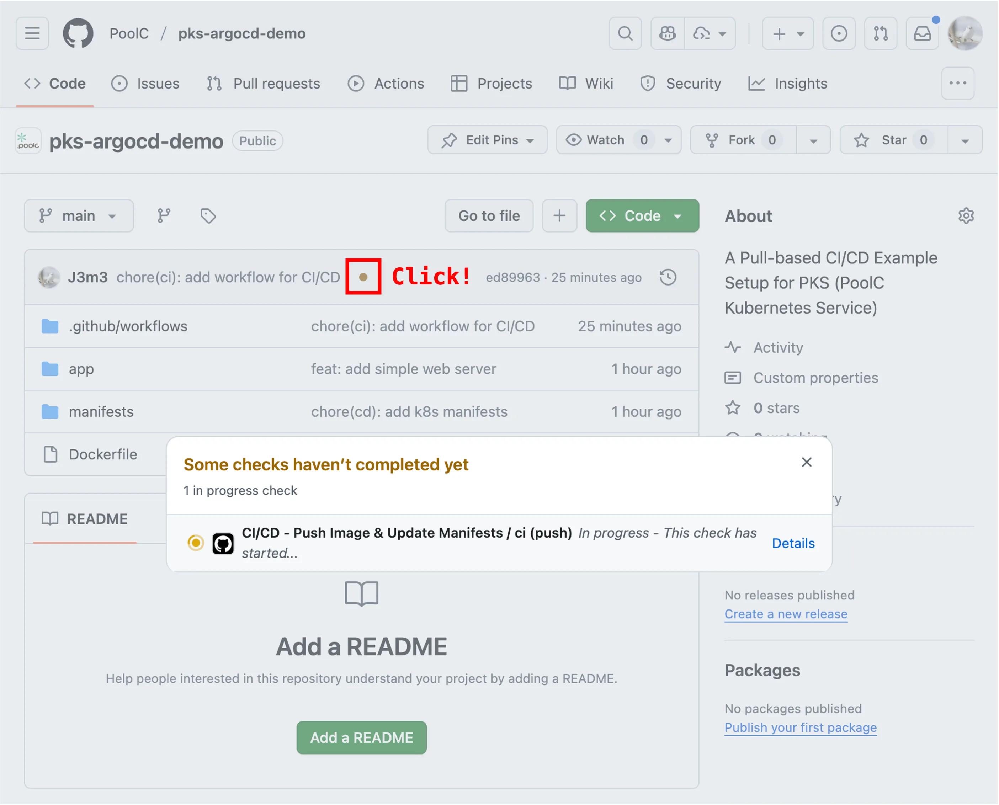
     <span>"PoolC" organization에서 레포지토리 이름으로 "pks-argocd-demo"를 사용한 예시</span>
   </p>

3. 상단의 "Actions" 탭에서 더 자세한 정보를 확인할 수 있습니다. ✅ 체크 표시가 활성화됐다면, workflow의
   실행이 성공적으로 완료된 것입니다.

   <p align="center">
     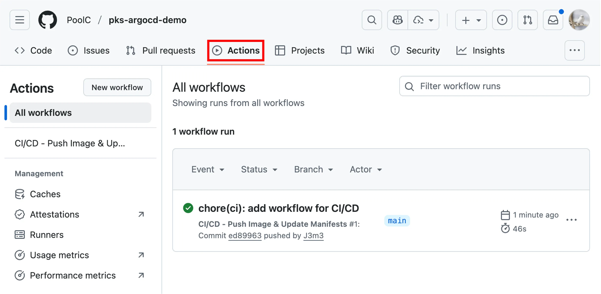
     <span>"PoolC" organization에서 레포지토리 이름으로 "pks-argocd-demo"를 사용한 예시</span>
   </p>

4. 최신 커밋을 확인하면, Workflow의 실행으로 인해 Deployment의 image 필드 값이 빌드된 이미지에 대한 레퍼런스로
   수정된 것을 알 수 있습니다.

   <p align="center">
     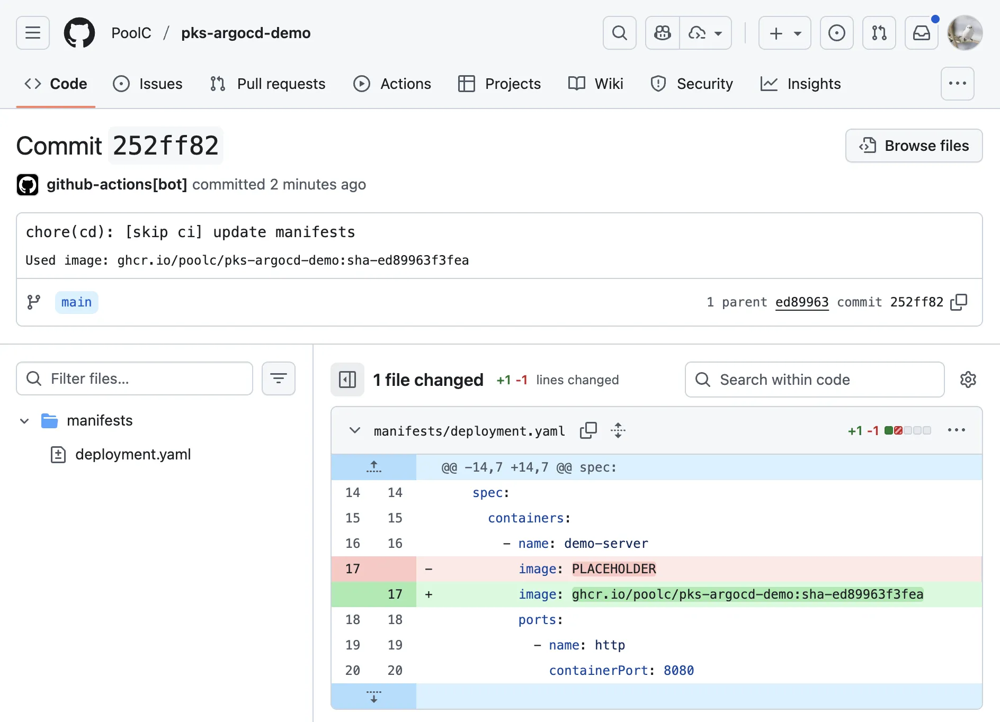
     <span>"PoolC" organization에서 레포지토리 이름으로 "pks-argocd-demo"를 사용한 예시</span>
   </p>

5. GitHub Packages Container Registry에 `deployment.yaml`이 참조하고 있는 이미지가 올바르게 업로드된
   것을 확인할 수 있습니다.

   <p align="center">
     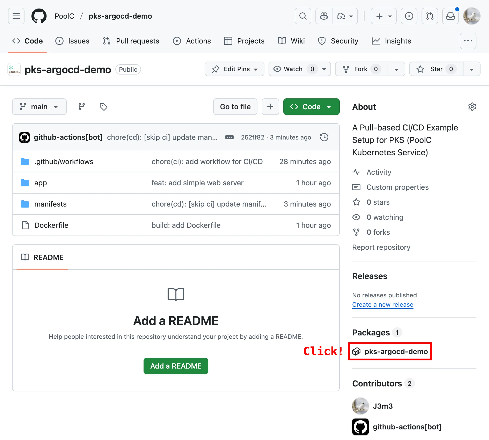
   </p>

   <p align="center">
     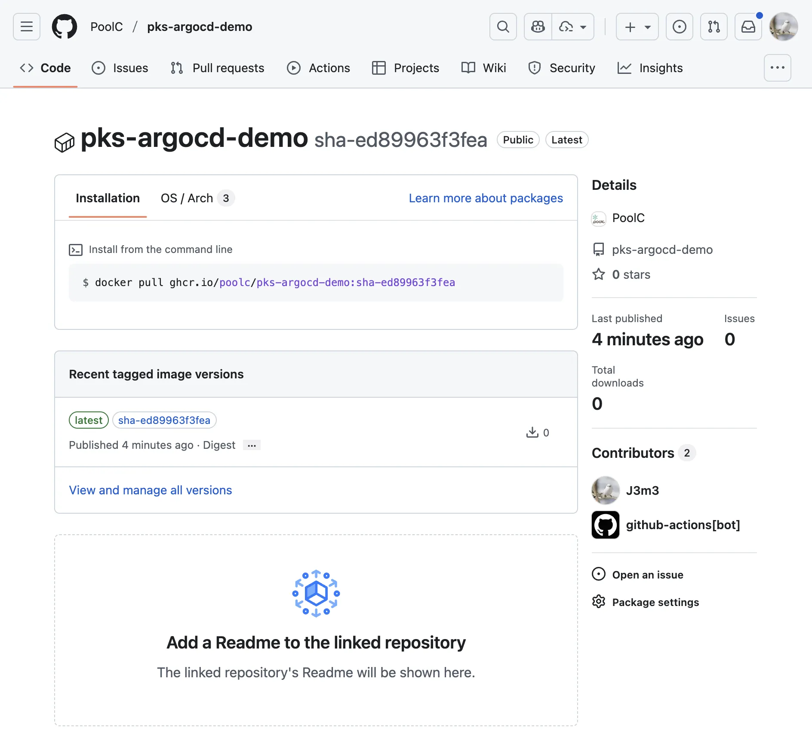
     <span>"PoolC" organization에서 레포지토리 이름으로 "pks-argocd-demo"를 사용한 예시</span>
   </p>

### Step 7. Argo CD에 GitHub 레포지토리 등록

> [!NOTE]
> Argo CD 로그인에 사용되는 계정은 동아리 구성원 전체가 함께 사용하는 공용 계정입니다.

시작하기 전, 먼저 [PoolC 홈페이지](https://poolc.org)에서 Argo CD 로그인을 위한 username과 password를
확인해주세요.

   
   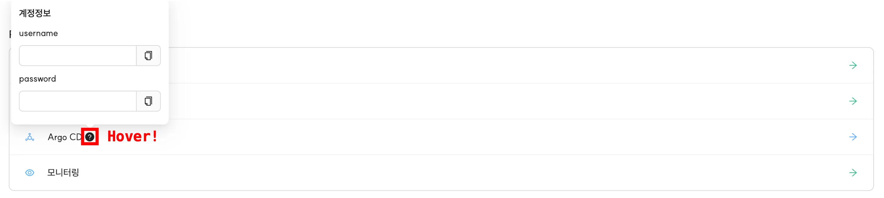

1. [http://argocd.dev.poolc.org](http://argocd.dev.poolc.org)에 접속한 뒤,
   풀씨 홈페이지에서 확인한 username과 password를 이용해 로그인해주세요.

2. "+ New App"을 클릭해 새로운 애플리케이션을 생성할 준비를 합니다.

   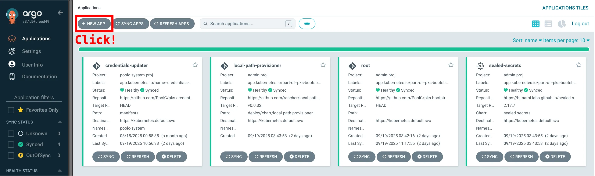

3. <a id="edit-using-ui">"GENERAL" 설정값을 입력합니다. "Application Name"을 제외한 나머지는 이미지와
   동일하게 설정해주세요.</a>

   `kubectl get applications -A` 명령어를 통해서도 전체 Application 목록을 확인할 수 있습니다.
   알파벳 소문자와 "-"만으로 이루어진 이름을 사용해주세요.

   <p align="center">
     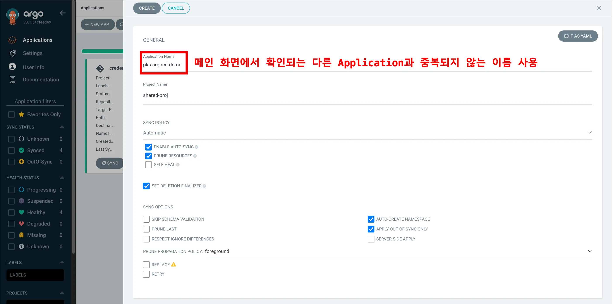
     <span>"Application Name"으로 "pks-argocd-demo"를 사용한 예시</span>
   </p>

4. <a id="edit-using-ui-ns">"SOURCE"와 "DESTINATION" 설정값을 입력합니다. "Namespace"를 제외한
   나머지는 이미지와 동일하게
   설정해주세요. 설정을 완료한 뒤 "CREATE"를 클릭해주세요.</a>

   `kubectl get ns` 명령어로 전체 Namespace 목록을 확인할 수 있습니다.
   알파벳 소문자와 "-"만으로 이루어진 이름을 사용해주세요.

   <p align="center">
     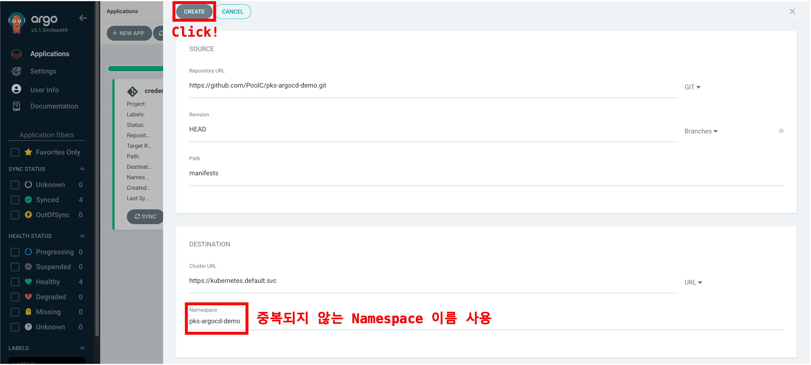
     <span>"Namespace"로 "pks-argocd-demo"를 사용한 예시</span>
   </p>

> [!TIP]
> 3 ~ 4번의 과정을 "EDIT AS YAML" 기능을 활용해 진행할 수도 있습니다. 이 경우 하나의 YAML 파일 내에서 전체
> 설정값을 정의하므로, 입력란을 하나하나 작성하지 않아도 됩니다. 더 자세한 내용은 부록의
> [Argo CD의 Application manifest](#argo-cd의-application-manifest)를 참조해주세요.

<!-- markdownlint-disable-next-line ol-prefix -->
5. 상세 보기를 통해 Application의 상태 및 하위 리소스를 확인할 수 있습니다.

   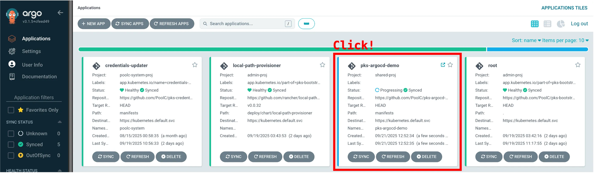
   <p align="center">
     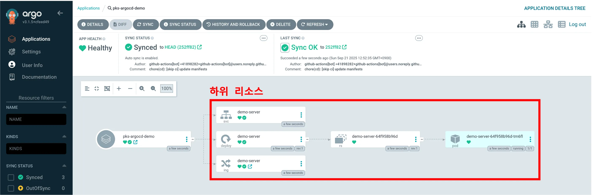
     <span>"Application Name" 및 "Namespace"로 "pks-argocd-demo"를 사용한 예시</span>
   </p>

<!-- markdownlint-disable-next-line ol-prefix -->
6. 상세 보기 화면에서 배포한 Python 웹 서버에 접속해볼 수 있습니다.

   <p align="center">
     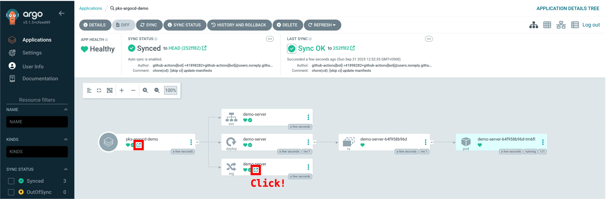
     <span>"Application Name" 및 "Namespace"로 "pks-argocd-demo"를 사용한 예시</span>
   </p>

   <p align="center">
     
     <span>서브도메인으로 "pks-argocd-demo"를 사용한 예시</span>
   </p>

### Step 8. CI/CD 파이프라인 테스트

[Motivation](#motivation)에서 언급했듯, 지금까지의 설정은 치후 코드 업데이트에 따른 배포 과정을 자동화하기
위함입니다. 편리함을 체감해보기 위해, `app/index.html`을 수정하고 레포지토리에 `git push` 해봅시다.

1. 아래 명령어를 기존의 작업 디렉토리에서 실행해주세요.

   ```bash
   sed "s/Hello, world/Hello, PoolC/" app/index.html > app/index.tmp \
       && mv app/index.tmp app/index.html
   
   git commit -am "feat: say hello to PoolC"
   git pull --rebase
   git push
   ```

2. Argo CD web UI에서 "Refresh"를 클릭하면, 실시간으로 업데이트되는 과정을 확인할 수 있습니다.

   현재 설정상 Argo CD는 직접 refresh를 해주지 않아도, 약 [2분 ~ 3분을 주기](https://argo-cd.readthedocs.io/en/stable/user-guide/auto_sync/#automated-sync-semantics)로
   등록된 GitHub 레포지토리의 `manifests` 디렉토리에서 관리되는 manifest에 변화가 있는지 확인합니다.

   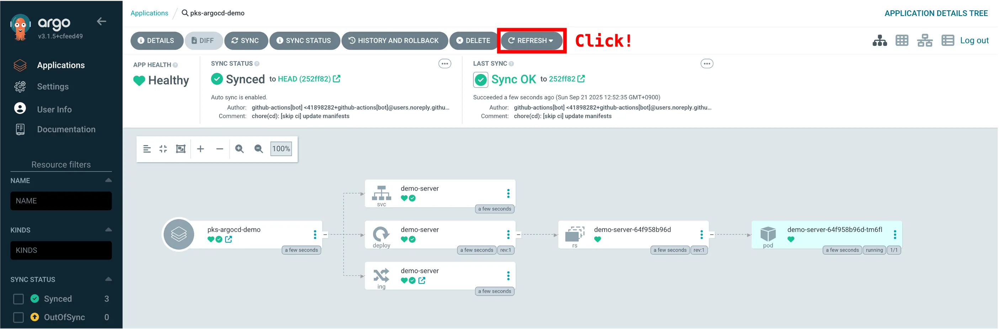

   <p align="center">
     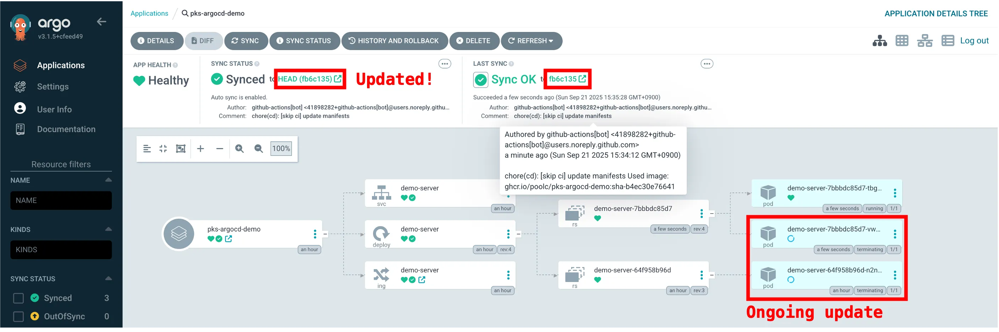
     <span>"Application Name" 및 "Namespace"로 "pks-argocd-demo"를 사용한 예시</span>
   </p>

3. Python 웹 서버에 접속하면, 업데이트한 변경사항이 반영되어 있어야 합니다.

   <p align="center">
     
     <span>서브도메인으로 "pks-argocd-demo"를 사용한 예시</span>
   </p>

### Step 9. 실습 완료 후 모든 자원 삭제하기

1. 생성한 Application의 상세 보기 화면에서, 해당 Application으로 관리되는 모든 하위 리소스를 삭제할 수 있습니다.

   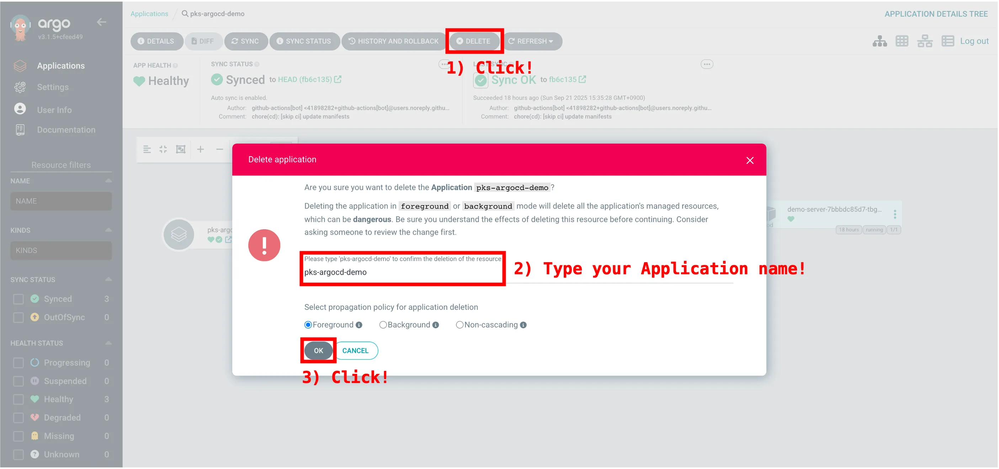

2. 아래 명령어를 참조해 [Application 설정](#edit-using-ui-ns)에서 입력했던 Namespace를
   삭제해주세요.

   ```bash
   kubectl delete ns $NAMESPACE_NAME
   ```

## 부록

### 전체 실습 실행 결과물

- [PoolC/pks-argocd-demo GitHub 레포지토리](https://github.com/PoolC/pks-argocd-demo)
- [pks-argocd-demo Application web UI](http://argocd.dev.poolc.org/applications/argocd/pks-argocd-demo)
- [배포된 Python 웹 서버](http://pks-argocd-demo.dev.poolc.org)

### GitOps와 Argo CD

> Argo CD is a declarative, GitOps continuous delivery tool for Kubernetes.
>
> -- [Argo CD Overview](https://argo-cd.readthedocs.io/en/stable/)

GitOps는 애플리케이션의 배포 상태를 Git으로 관리하는 DevOps 방법론입니다. 따라서 Git의 장점인 "쉬운 변경사항
추적과 롤백"을 애플리케이션 배포에 고스란히 적용할 수 있습니다. Pull request가 병합되면 개발자의 큰 개입이 없어도
자동으로 배포가 진행되고, 현재 배포된 어플리케이션에 문제가 있을 경우 `git revert`를 사용할 수도 있으며, 이러한
모든 활동들이 모두 투명하게 기록되기 때문에 문제가 발생한 지점을 파악하기도 비교적 수월합니다.

Argo CD는 이러한 GitOps 철학하에, 일반적으로 아래 과정을 통해 배포를 자동화합니다.

1. Git 레포지토리의 배포 manifest에 대한 변화 감지
2. 변경사항을 pull하여 최신 상태로 동기화
3. 배포 manifest에 정의된 desired state와 현재 클러스터의 live state를 비교
4. 차이가 있을 경우 필요한 리소스를 생성, 수정하여 일관성 유지

### Argo CD의 Application manifest

Argo CD는 배포되는 애플리케이션을
[Application](https://argo-cd.readthedocs.io/en/stable/user-guide/application-specification/)이라는
[custom resource](https://kubernetes.io/docs/concepts/extend-kubernetes/api-extension/custom-resources/)를
통해 관리합니다. Application 리소스에 대한 manifest는 어떤 레포지토리에서, 무엇을, 어떻게 배포할지 정의합니다.

Argo CD web UI의 "EDIT AS YAML" 기능을 이용해 Application 리소스에 대한 manifest를 직접 제출할 수
있습니다. [본문](#edit-using-ui)의 과정을 "EDIT AS YAML" 기능을 활용해 진행하면 아래와 같습니다.

1. "EDIT AS YAML"을 클릭해주세요.

   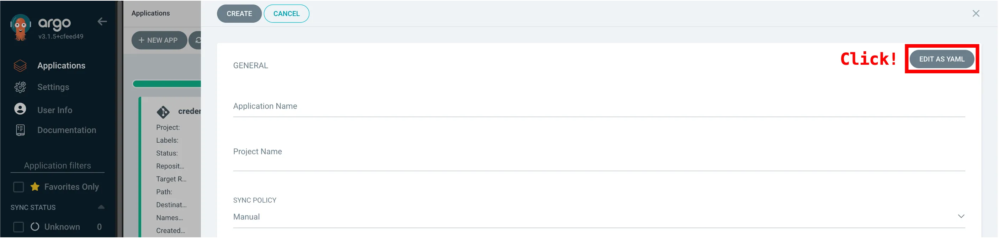

2. 아래의 `$APPLICATION_NAME`과 `$NAMESPACE_NAME`을 알맞게 수정해주세요. 수정한 내용을 복사해 붙여넣고,
   "SAVE"와 "CREATE" 버튼을 차례로 클릭해주세요.

   ```yaml
   apiVersion: argoproj.io/v1alpha1
   kind: Application
   metadata:
     name: $APPLICATION_NAME
     namespace: argocd
     finalizers:
       - resources-finalizer.argocd.argoproj.io
   spec:
     project: shared-proj
     source:
       repoURL: https://github.com/PoolC/pks-argocd-demo.git
       path: manifests
       targetRevision: HEAD
     destination:
       server: https://kubernetes.default.svc
       namespace: $NAMESPACE_NAME
     syncPolicy:
       automated:
         prune: true
         enabled: true
       syncOptions:
         - CreateNamespace=true
         - ApplyOutOfSyncOnly=true
   ```

   <p align="center">
     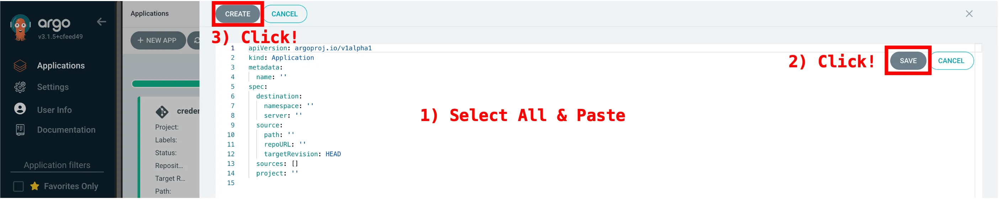
     <span>"Application Name" 및 "Namespace"로 "pks-argocd-demo"를 사용한 예시</span>
   </p>

> [!NOTE]
> Application manifest의 내용은 Application 삭제 시 모두 유실되므로, 별도 백업 또는 Git을 통한
> 관리가 권장됩니다.

### GitHub Actions가 무엇인가요?

> GitHub Actions is a continuous integration and continuous delivery (CI/CD)
> platform that allows you to automate your build, test, and deployment pipeline.
>
> -- [Understanding GitHub Actions](https://docs.github.com/en/actions/get-started/understand-github-actions#overview)

GitHub Actions는 레포지토리에 특정한 이벤트(ex. `git push`)가 발생했을 때, 직접 설정한 일련의 작업들을 수행할
수 있는 플랫폼입니다. GitHub에서 정해놓은 [workflows syntax](https://docs.github.com/en/actions/reference/workflows-and-actions/workflow-syntax)에
맞춰 YAML 파일을 작성하면, 해당 작업이 GitHub가 관리하는 컴퓨터 자원에서 수행됩니다.
