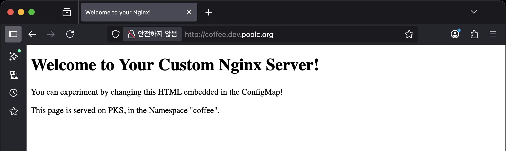
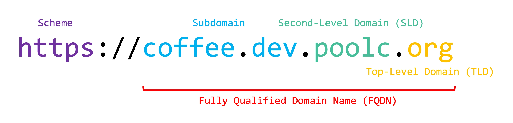

# PKS (PoolC Kubernetes Service) 101

PKS (PoolC Kubernetes Service)는 PoolC 동아리원이 자유롭게 이용할 수 있는 온프레미스 쿠버네티스 서비스입니다.

여기서 "쿠버네티스"는 컨테이너화된 애플리케이션의 배포, 확장, 관리를 자동화하는 오픈소스 플랫폼입니다. Google에서
개발해 2014년에 오픈소스로 공개되었고, 현재는 Cloud Native Computing Foundation(CNCF)에서 관리하고
있습니다.

## 목차

- [Disclaimer](#disclaimer)
- [Quick Start](#quick-start)
  - [Step 1. Nginx 배포하기](#step-1-nginx-배포하기)
  - [Step 2. 배포한 Nginx에 접속하기](#step-2-배포한-nginx에-접속하기)
  - [Step 3. 배포 내용 수정해보기](#step-3-배포-내용-수정해보기)
  - [Step 4. 실습 완료 후 모든 자원 삭제하기](#step-4-실습-완료-후-모든-자원-삭제하기)
- [Use Cases](#use-cases)
- [더 알아보기](#더-알아보기)
- [What's Next?](#whats-next)
- [부록](#부록)
  - [쿠버네티스 핵심 개념](#쿠버네티스-핵심-개념)
  - [Namespace가 무엇인가요?](#namespace가-무엇인가요)
  - [Namespace 하위 리소스에 대한 권한 부여받기](#namespace-하위-리소스에-대한-권한-부여받기)
  - [서브도메인이 무엇인가요?](#서브도메인이-무엇인가요)

## Disclaimer

이 문서는 빠르게 **PKS 클러스터를 사용할 수 있도록 돕는 데에 초점**이 맞춰져 있습니다. 쿠버네티스의 동작 원리와 등장
배경도 매우 흥미로운 내용이지만, 본 문서에서 모두 다루기에는 너무 방대하기 때문입니다. 문서를 읽으시며 생겨나는
물음표들을 해결하고 싶으시다면, [더 알아보기](#더-알아보기) 섹션을 참고해주세요.

## Quick Start

> [!IMPORTANT]
> 사용자 가이드 [README](./README.md)의 모든 설정을 마친 이후에 아래 가이드를 따라와 주세요. 특히 YSVPN이
> 활성화되어 있어야 합니다!

Nginx를 배포하고 이것저것 수정해보면서, PKS와 친해지는 시간을 가져봅시다. :D

### Step 1. Nginx 배포하기

> [!CAUTION]
> Windows CMD, Powershell 환경의 경우 아래 스크립트가 제대로 동작하지 않습니다. Git bash를 이용하시거나,
> WSL 환경에서 작업하시길 권장드립니다.

먼저 Nginx 배포를 위한 설정값과 Nginx에서 사용할 HTML을 작성한 후, PKS에 해당 내용을 제출해야 합니다.

1. 하단의 스크립트 내용을 복사한 후, 사용하는 텍스트 에디터에 붙여넣어주세요.
2. `NAMESPACE_NAME`을 원하는 값으로 수정해주세요.
   - 예시: `coffee`
   - 참조: [Namespace가 무엇인가요?](#namespace가-무엇인가요)
3. `SUBDOMAIN_NAME`을 원하는 값으로 수정해주세요.
   - 예시: `coffee`
   - 참조: [서브도메인이 무엇인가요?](#서브도메인이-무엇인가요)
4. 수정된 스크립트를 로컬 터미널에 그대로 복사 & 붙여넣기해 실행해주세요.

> [!NOTE]
> PKS에 배포되는 워크로드들은 `dev.poolc.org` 하위의 서브도메인을 **서로 겹치지 않는 선에서** 자유롭게 사용
> 가능합니다. `kubectl get ingress --all-namespaces` 명령어를 통해 현재 사용 중인 도메인을 확인하고, 겹치지
> 않는 서브도메인을 사용해주세요.

```bash
NAMESPACE_NAME="UNIQUE_STRING_WITH_LOWERCASE_ALPHABET_OR_HYPHEN"
SUBDOMAIN_NAME="UNIQUE_STRING_WITH_LOWERCASE_ALPHABET_OR_HYPHEN"

kubectl apply -f - <<EOF
apiVersion: v1
kind: Namespace
metadata:
  name: $NAMESPACE_NAME
EOF

# 해당 Namespace 하위에 새로운 리소스를 만드는 권한을 부여받을 때까지 대기
# (부록: "Namespace 하위 리소스에 대한 권한 부여받기" 참조)
echo "Waiting for RoleBinding to be created..."
while ! kubectl auth can-i create pods -q -n "$NAMESPACE_NAME"; do
  sleep 1
done

kubectl apply -f - <<EOF
---
apiVersion: v1
kind: ConfigMap
metadata:
  name: my-html
  namespace: $NAMESPACE_NAME
data:
  index.html: |
    <!DOCTYPE html>
    <html>
    <head>
    <title>Welcome to your Nginx!</title>
    </head>
    <body>
    <h1>Welcome to Your Custom Nginx Server!</h1>
    <p>You can experiment by changing this HTML embedded in the ConfigMap!</p>
    <p>This page is served on PKS, in the Namespace "$NAMESPACE_NAME".</p>
    </body>
    </html>
---
apiVersion: apps/v1
kind: Deployment
metadata:
  name: my-deployment
  namespace: $NAMESPACE_NAME
spec:
  replicas: 1
  selector:
    matchLabels:
      whatever: is_ok_but_should_match
  template:
    metadata:
      labels:
        whatever: is_ok_but_should_match
    spec:
      containers:
        - name: my-nginx
          image: nginx:latest
          ports:
            - containerPort: 80
          volumeMounts:
            - name: my-volume
              mountPath: /usr/share/nginx/html
      volumes:
        - name: my-volume
          configMap:
            name: my-html
---
apiVersion: v1
kind: Service
metadata:
  name: my-service
  namespace: $NAMESPACE_NAME
spec:
  type: ClusterIP
  ports:
    - port: 8080
      targetPort: 80
      protocol: TCP
  selector:
    whatever: is_ok_but_should_match
---
apiVersion: networking.k8s.io/v1
kind: Ingress
metadata:
  name: my-ingress
  namespace: $NAMESPACE_NAME
  annotations:
    nginx.ingress.kubernetes.io/backend-protocol: HTTP
spec:
  ingressClassName: nginx
  rules:
    - host: $SUBDOMAIN_NAME.dev.poolc.org
      http:
        paths:
          - path: /
            pathType: Prefix
            backend:
              service:
                name: my-service
                port:
                  number: 8080
EOF
```

정상적으로 실행이 완료되었다면, 아래와 유사한 로그가 출력되어야 합니다.

```
namespace/$NAMESPACE_NAME created
Waiting for RoleBinding to be created...
configmap/my-html created
deployment.apps/my-deployment created
service/my-service created
ingress.networking.k8s.io/my-ingress created
```

### Step 2. 배포한 Nginx에 접속하기

이제 브라우저에서 `$SUBDOMAIN_NAME.dev.poolc.org` 주소로 접속하면, 스크립트에 포함되어 있는 HTML 문서를
확인할 수 있습니다.

<p align="center">
    <!-- TODO: 이미지 에셋 디렉토리 구조 변경 -->
    
    <br />
    <span>"coffee"를 서브 도메인으로 사용한 예시</span>
</p>

### Step 3. 배포 내용 수정해보기

스크립트에 포함되어 있는 HTML 문서, 서브도메인을 자유롭게 수정하면서 배포된 웹페이지의 변화를 확인해보세요! 삭제 후
재생성할 필요 없이, 원하는 부분만 수정한 뒤 이전과 동일하게 전체 내용을 복사 & 붙여넣기해 실행하시면 됩니다.

로그 내용에서 확인할 수 있듯, 쿠버네티스는 알아서 변경된 리소스만을 업데이트합니다.

```
namespace/$NAMESPACE_NAME unchanged
Waiting for RoleBinding to be created...
configmap/my-html configured
deployment.apps/my-deployment unchanged
service/my-service unchanged
ingress.networking.k8s.io/my-ingress unchanged
```

### Step 4. 실습 완료 후 모든 자원 삭제하기

실행한 스크립트로 생성된 모든 것을 삭제하고 싶다면, `$NAMESPACE_NAME`를 생성한 Namespace의 이름으로 대체한 뒤
아래 명령어를 실행해주세요.

```bash
kubectl delete namespace $NAMESPACE_NAME
```

## Use Cases

PKS는 다양한 use case를 염두에 두고 개발되었습니다.

- 여러 동아리원이 협업해 프로젝트를 진행하는 경우
  - 개발자가 아닌 팀원 입장에서는, Docker와 같은 소프트웨어 설치 없이 개발 결과물을 도메인
    접속만으로 쉽게 확인할 수 있습니다.
  - 개발자 팀원 입장에서는, 한 번의 설정으로 배포 과정을 단순화할 수 있습니다.
- 세미나, 스터디 등에서 동일한 실행 환경을 보장해야 하는 경우
  - 세미나장이 미리 PKS에 필요한 환경을 모두 세팅해놓으면, 세미나 참여자에게 환경 설정에 대한 부담을 지우지 않아도
    됩니다.
- 실습/프로젝트형 세미나에서 배포 과정까지 다루려는 경우
  - AWS, GCP, Azure와 같은 클라우드 서비스의 복잡성에 방해받지 않고, 핵심적인 내용을 전달하는 데 집중할 수
    있습니다.
- PKS의 각종 설정을 뜯어보며 쿠버네티스에 대해 학습하는 경우
- 그 외 동아리원이 공용으로 사용할 워크로드를 배포하려는 경우

이외에도 여러 use case들이 있겠지만, 공통적으로 "큰 부담 없이 사용해볼 수 있는 장난감"의 느낌으로 이용해주시면
더할 나위 없이 좋을 것 같습니다! :)

## 더 알아보기

- [Kubernetes Explained in 15 Minutes | Hands On (2024 Edition)](https://youtu.be/r2zuL9MW6wc?si=fD1tdVLekYApg5XO)
- [초보를 위한 쿠버네티스 안내서](https://subicura.com/k8s/)
  - 해당 자료에서는 `minikube`를 활용해 로컬 환경에 쿠버네티스 클러스터를 생성합니다. 이미 PKS 클러스터가 구축되어
    있으므로, 별도로 `minikube`를 설치하지 않으셔도 됩니다.
- [Kubernetes Documentation / Concepts](https://kubernetes.io/docs/concepts/)

## What's Next?

TODO: 각 문서가 완성되면 링크 추가

- Argo CD를 활용해 GitOps 기반의 개발 프로세스 확립하기
- PKS에서 데이터베이스 워크로드 관리하기 (feat. StatefulSet, PersistentVolumeClaim)

## 부록

### 쿠버네티스 핵심 개념

쿠버네티스에서는 내가 원하는 앱의 배포 상태를 기록한 YAML 파일을 클러스터에 제출하는 방식으로 배포를 진행합니다.
앞선 예시의 일부를 다시 한번 살펴볼까요?

`demo.yaml`

```yaml
apiVersion: apps/v1
kind: Deployment
metadata:
  name: my-deployment
  namespace: $NAMESPACE_NAME
spec:
  replicas: 1
  selector:
    matchLabels:
      whatever: is_ok_but_should_match
  template:
    metadata:
      labels:
        whatever: is_ok_but_should_match
    spec:
      containers:
        - name: my-nginx
          image: nginx:latest
          ports:
            - containerPort: 80
```

위 YAML 파일의 `$NAMESPACE_NAME`을 수정한 후 `kubectl apply -f demo.yaml` 명령어를 통해 제출하면,
쿠버네티스는 배포의 최소 단위인 [Pod](https://kubernetes.io/docs/concepts/workloads/pods/)를
생성하고, 해당 Pod 내에 YAML 파일에 기록된 컨테이너를 생성합니다.

이후 모종의 이유로(Pod 내 컨테이너 프로세스 오류, Pod가 동작하던 컴퓨터의 HW failure 등) 배포 상태가 YAML
파일에 기록해둔 내용과 달라질 경우, 쿠버네티스는 이를 감지해 자동으로 배포 상태를 YAML 파일의 내용과 동기화시키려고
노력합니다. 예를 들어 Pod가 동작하던 컴퓨터의 전원이 꺼진 경우, 쿠버네티스는 자동으로 해당 Pod를 쿠버네티스가 관리
중인 다른 컴퓨터로 이전합니다. (항상 그런 것은 아니지만, 적어도 위 YAML 파일에 대해서는 일반적으로 이렇게 동작합니다.)

즉, 쿠버네티스는 사용자가 원하는 배포 상태를 안정적으로 유지할 수 있도록 도움을 주는 도구입니다.

### Namespace가 무엇인가요?

쿠버네티스에는 격리된 작업 공간을 만드는
[Namespace](https://kubernetes.io/docs/concepts/overview/working-with-objects/namespaces/)
라는 기능이 있습니다.
[Deployment](https://kubernetes.io/docs/concepts/workloads/controllers/deployment/),
[Service](https://kubernetes.io/docs/concepts/services-networking/service/),
[Ingress](https://kubernetes.io/docs/concepts/services-networking/ingress/) 등과 같은 리소스들은
이러한 Namespace 하위에 생성할 수 있으며, Namespace 내에서 각 리소스는 유일한 이름을 가져야 합니다. 즉
`ns-a` Namespace에 `deploy-a`라는 Deployment가 존재한다면, `deploy-a`라는 이름을 갖는 새로운
Deployment를 `ns-a`에서는 생성할 수 없습니다. 이러한 제한은 Namespace _내에서만_ 유효하며, 서로 다른
Namespace에서는 동일한 이름의 리소스가 존재할 수 있습니다. 예를 들어, `deploy-a`라는 이름의 Deployment가
서로 다른 `ns-a`, `ns-b` Namespace에 모두 존재할 수 있습니다. 이를 간단히 그림으로 표현하면 아래와 같습니다.

```
# ✅ 서로 다른 Namespace에서는 동일한 이름 사용 가능
.---------------------------.  .---------------------------.
|      Namespace: ns-a      |  |      Namespace: ns-b      |
|---------------------------|  |---------------------------|
|  .---------------------.  |  |  .---------------------.  |
|  | Deployment:deploy-a |  |  |  | Deployment:deploy-a |  |
|  '---------------------'  |  |  '---------------------'  |
|  .---------------------.  |  |  .---------------------.  |
|  |    Service:svc-a    |  |  |  |    Service:svc-a    |  |
|  '---------------------'  |  |  '---------------------'  |
'---------------------------'  '---------------------------'

# ❌ Namespace 내에서는 리소스별로 유일한 이름만 사용 가능
.---------------------------.
|      Namespace: ns-a      |
|---------------------------|
|  .---------------------.  |
|  |   Deployment:same   |  | <-.
|  '---------------------'  |    \
|                           |    | ✅ 서로 다른 리소스끼리는 동일한 이름을 가져도 무방
|  .---------------------.  |    /
|  |    Service:same     |  | <-'
|  '---------------------'  |
|  .---------------------.  |
|  |    Service:same     |  | <--- ❌ 같은 이름의 리소스는 공존 불가능
|  '---------------------'  |
'---------------------------'
```

> [!CAUTION]
> Namespace가 `kubectl delete namespace <namespace-name>` 등의 명령어로 삭제될 경우, 해당 Namespace
> 하위의 모든 리소스는 자동으로 삭제됩니다.

### Namespace 하위 리소스에 대한 권한 부여받기

PKS에서는 Namespace가 생성되면, 자동으로 해당 Namespace를 생성한 사용자에게 Namespace 하위의 각종 리소스를
읽고 쓸 수 있는 권한을 부여합니다. 다만 이 권한이 부여되기까지 약간의 딜레이가 있을 수 있으므로, 필요한 권한이 부여될
때까지 대기하는 것이 좋습니다.

> [!NOTE]
> 바꿔 말하면 Namespace를 직접 생성하지 않는 이상, Deployment, Service 등의 리소스를 생성할 수 없다는
> 뜻입니다. 항상 새로운 Namespace를 먼저 생성한 후, 해당 Namespace 내에서 작업을 이어가 주세요.

### 서브도메인이 무엇인가요?

우리가 평소에 흔히 접하는 웹페이지의 주소는 아래와 같은 형식으로 이루어져 있습니다.



이 중에서 subdomain은 second-level domain 하위(왼편)에 위치하는 도메인들을 가리킵니다.
