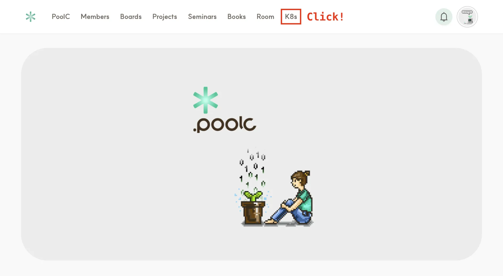
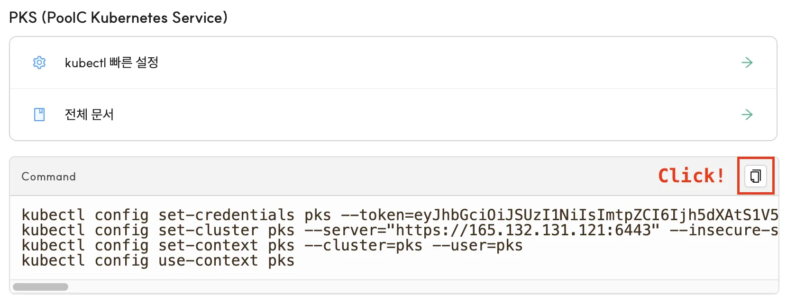

# Quick? Setup

## 목차

- [YSVPN 활성화](#0-ysvpn-활성화)
- [`kubectl` 바이너리 설치](#1-kubectl-바이너리-설치)
  - [패키지 매니저를 통해 다운로드](#패키지-매니저를-통해-다운로드)
  - [정적 바이너리 다운로드](#정적-바이너리-다운로드)
- [kubeconfig 파일 셋업](#2-kubeconfig-파일-셋업)
- [클러스터 접속 테스트](#3-클러스터-접속-테스트)
- [(Optional) CA 인증서 설정](#4-optional-ca-인증서-설정)
- [클러스터 접속용 토큰 업데이트](#클러스터-접속용-토큰-업데이트)
- [What's Next?](#whats-next)
- [부록](#부록)
  - [`kubectl config` 명령어들은 무슨 일을 하나요?](#kubectl-config-명령어들은-무슨-일을-하나요)

## 0. YSVPN 활성화

PKS 클러스터는 연세대학교 사설망 내부에 설치되어 있습니다. 교내 네트워크(yonsei Wi-Fi, poolc-5g Wi-Fi 등)를
이용하지 않고 **외부에서 접속하는 경우에 한해**, YSVPN을 이용해야 합니다. 정보통신처의
[YSVPN 관련 공지사항](https://yis.yonsei.ac.kr/ics/service/PolicyApplyInfo.do)과
[YSVPN 사용자 메뉴얼](https://ibook.yonsei.ac.kr/Viewer/ysvpn_user_manual)을 통해 각자의 환경에 맞게
YSVPN을 설치해주세요.

## 1. `kubectl` 바이너리 설치

CLI 명령어 도구인 `kubectl`를 이용해 PKS 클러스터에 접근할 수 있습니다. 설치 방법에 대한 더 자세한 내용을 원하시는 경우,
[쿠버네티스 공식 문서](https://kubernetes.io/docs/tasks/tools/#kubectl)를 참조해주세요.

### 패키지 매니저를 통해 다운로드

#### Ubuntu (Debian-based)

```bash
KUBERNETES_VERSION=v1.33
sudo apt install apt-transport-https ca-certificates curl gnupg
curl -fsSL https://pkgs.k8s.io/core:/stable:/$KUBERNETES_VERSION/deb/Release.key | sudo gpg --dearmor -o /etc/apt/keyrings/kubernetes-apt-keyring.gpg
sudo chmod 644 /etc/apt/keyrings/kubernetes-apt-keyring.gpg
echo "deb [signed-by=/etc/apt/keyrings/kubernetes-apt-keyring.gpg] https://pkgs.k8s.io/core:/stable:/$KUBERNETES_VERSION/deb/ /" | sudo tee /etc/apt/sources.list.d/kubernetes.list
sudo chmod 644 /etc/apt/sources.list.d/kubernetes.list
sudo apt update
sudo apt install kubectl
```

#### Mac (with Homebrew)

```bash
brew install kubernetes-cli
```

#### Windows (with Chocolatey)

```bash
choco install kubernetes-cli
```

### 정적 바이너리 다운로드

`kubectl` 바이너리는
[downloadkubernetes.com](https://www.downloadkubernetes.com/)에서 다운로드받을 수 있습니다.

<p align="center">
    <!-- TODO: 이미지 에셋 디렉토리 구조 변경 -->
    
    <br />
    <span>Windows에서 바이너리를 다운로드받는 예시</span>
</p>

## 2. kubeconfig 파일 셋업

> [!WARNING]
> 풀씨 홈페이지에서 복사한 토큰이 타인에게 노출되지 않도록 주의해주세요! 해당 토큰은 PKS 클러스터에 접속하기 위한
> ID 및 비밀번호의 역할을 대신합니다.

1. [풀씨 홈페이지](https://poolc.org)에 접속해 상단 네비게이션 바의 "K8s"를 클릭합니다.

   

2. "PKS (PoolC Kubernetes Service)" 섹션에서 커맨드를 복사합니다.

   

3. 그대로 로컬 터미널에 붙여넣어 실행합니다.

4. 아래와 같이 오류 없이 명령어가 실행됐다면, 클러스터 접속을 위한 준비를 모두 마친 것입니다.

   ```
   User "pks" set.
   Cluster "pks" set.
   Context "pks" created.
   Switched to context "pks".
   ```

## 3. 클러스터 접속 테스트

정상적으로 설정이 완료되었다면, 아래 명령어가 오류 없이 실행되어야 합니다.

```console
$ kubectl get namespaces
NAME                 STATUS   AGE
argocd               Active   62d
cilium-secrets       Active   79d
default              Active   79d
ingress-nginx        Active   78d
kube-node-lease      Active   79d
kube-public          Active   79d
kube-system          Active   79d
kyverno              Active   13d
local-path-storage   Active   18d
monitoring           Active   74d
pks-argocd-demo      Active   11d
poolc-system         Active   13d
poolc-users          Active   33h
```

더 다양한 `kubectl` 명령어가 궁금하시다면, [`kubectl` Quick Reference](./kubectl-quick-ref.md)를
참조해주세요!

## 4. (Optional) CA 인증서 설정

`kubectl` CLI 도구는 HTTPS를 통해 PKS 클러스터의 API 서버와 통신합니다. 해당 과정에서 API 서버의 디지털
인증서를 검증하기 위해서는, PKS 클러스터의 self-signed CA 인증서가 필요합니다. self-signed CA 인증서는
[PKS-docs 레포지토리](/ca.crt)에서 다운로드받을 수 있습니다.

이후 아래 명령어로 kubeconfig 파일을 업데이트하여 `kubectl`이 해당 CA 인증서를 사용하도록 설정할 수 있습니다.

```bash
kubectl config set-cluster pks \
  --server="https://165.132.131.121:6443" \
  --embed-certs=true \
  --certificate-authority=<path/to/ca.crt>
```

## 클러스터 접속용 토큰 업데이트

PKS 클러스터의 접속 권한은 **7일을 주기로 매주 월요일 00시 00분에 업데이트**됩니다. 토큰이 만료되어 접속이 불가능한
경우, 풀씨 홈페이지에서 접속용 명령어를 복사해 다시 실행해주세요.

> [!NOTE]
> "4. (Optional) CA 인증서 설정"을 진행하신 경우, 복사 및 붙여넣기로 실행한 명령어가 해당 설정을 덮어씌우게
> 됩니다. 기존의 설정을 유지하시려는 경우, CA 인증서 설정을 다시 한번 진행해주세요.

## What's Next?

TODO: 각 문서가 완성되면 링크 추가

- [PoolC Kubernetes Service 101](./PKS-101.md)
- [`kubectl` Quick Reference](./kubectl-quick-ref.md)
- [리소스 사용량 및 로그 모니터링하기](./monitoring.md)
- Argo CD를 활용해 GitOps 기반의 개발 프로세스 확립하기
- PKS에서 데이터베이스 워크로드 관리하기 (feat. StatefulSet, PersistentVolumeClaim)

## 부록

### `kubectl config` 명령어들은 무슨 일을 하나요?

`kubectl` CLI 도구는 소위 "kubeconfig 파일"을 참조해 어떤 프로필로 Kubernetes 클러스터에 접속할지 결정합니다.
`kubectl config` 명령어들은 이 kubeconfig 파일(기본 위치: `~/.kube/config`)을 수정합니다. 아래는 예시
`~/.kube/config` 파일의 내용입니다.

```yaml
apiVersion: v1
kind: Config
preferences: {}
clusters: # `kubectl config set-cluster`를 통해 수정되는 부분
  - cluster:
      certificate-authority-data: <CA_CERT>
      server: https://165.132.131.121:6443
    name: pks
users: # `kubectl config set-credentials`를 통해 수정되는 부분
  - user:
      token: <JWT>
    name: pks
contexts: # `kubectl config set-context`를 통해 수정되는 부분
  - context:
      cluster: pks
      user: pks
    name: pks
current-context: pks # `kubectl config use-context`를 통해 수정되는 부분
```

주요 명령어별 역할은 아래와 같습니다.

- `kubectl config set-cluster`: 클러스터 정보(API 서버 주소, 인증서 등) 등록
- `kubectl config set-credentials`: 사용자 인증 정보 (토큰, 인증서 등) 등록
- `kubectl config set-context`: 클러스터와 사용자를 하나로 묶어서 관리할 수 있는 컨텍스트 설정
- `kubectl config use-context`: 사용할 컨텍스트 선택

더 자세한 정보는 아래 내용들을 참고해주세요!

- `kubectl config help` 명령어 출력 결과
- https://kubernetes.io/docs/concepts/configuration/organize-cluster-access-kubeconfig/
- https://kubernetes.io/docs/tasks/access-application-cluster/configure-access-multiple-clusters/
- https://kubernetes.io/docs/reference/kubectl/generated/kubectl_config/#see-also
