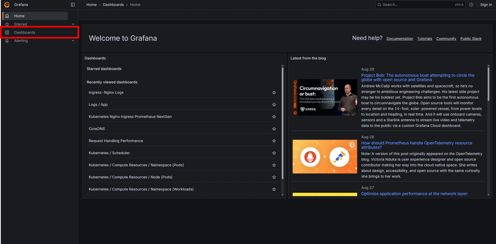
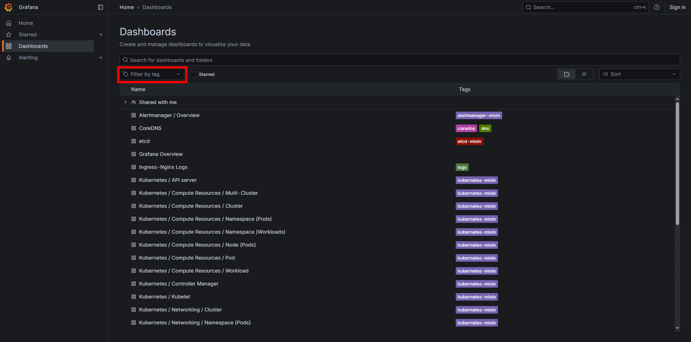
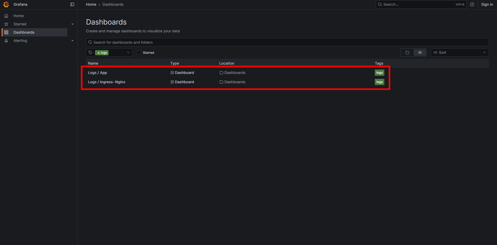
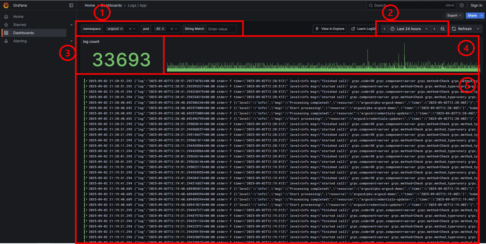
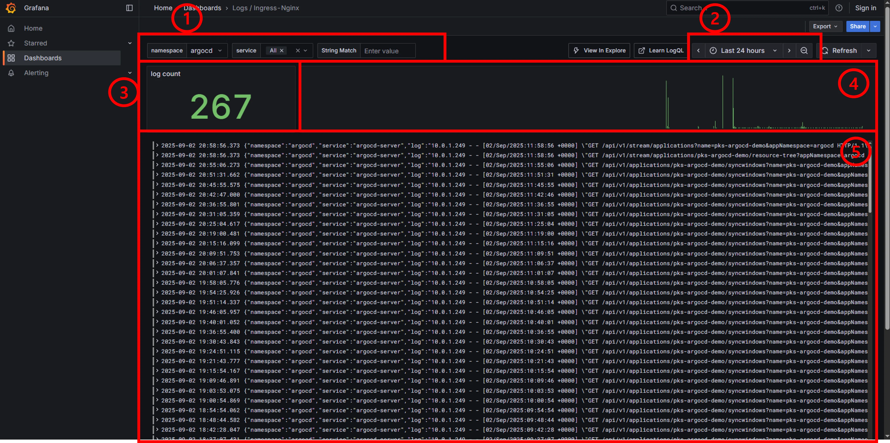
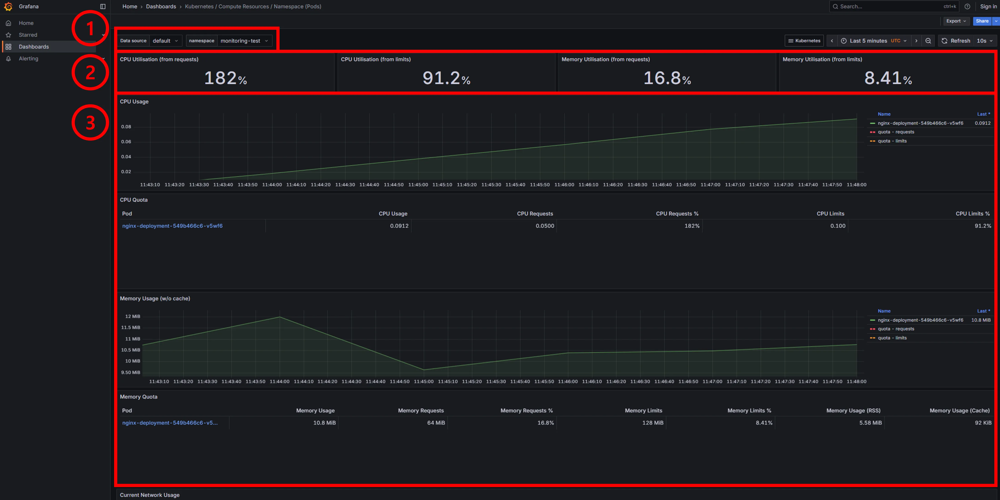

# PKS에서 내 애플리케이션 관찰하기

PKS(PoolC Kubernetes Service)는 Grafana를 이용한 모니터링 대시보드를 제공하여, 사용자가 배포한 애플리케이션의
로그와 성능지표를 쉽게 확인하고 분석할 수 있도록 돕습니다.

이 문서는 PKS에 간단한 웹 서버를 배포하고, Grafana 대시보드를 통해 해당 서버에서 발생하는 로그와 성능지표를
실시간으로 확인하는 과정을 안내합니다.

## 목차

- [Disclaimer](#disclaimer)
- [실습 환경 구성](#0-실습-환경-구성)
  - [클러스터 접속 테스트](#클러스터-접속-테스트)
  - [모니터링 페이지 접속 테스트](#모니터링-페이지-접속-테스트)
- [Quick Start](#quick-start)
  - [Step 1. Nginx 배포하기](#step-1-nginx-배포하기)
  - [Step 2. 로그 생성 및 확인하기](#step-2-로그-생성-및-확인하기)
  - [Step 3. Metric 확인하기](#step-3-metric-확인하기)
  - [Step 4. 실습 완료 후 모든 자원 삭제하기](#step-4-실습-완료-후-모든-자원-삭제하기)
- [What's Next?](#whats-next)
- [부록](#부록)
  - [Grafana가 무엇인가요?](#grafana가-무엇인가요)
  - [Ingress-NGINX가 무엇인가요?](#ingress-nginx가-무엇인가요)
  - [애플리케이션 로그와 access 로그의 차이](#애플리케이션-로그와-access-로그의-차이)

## Disclaimer

이 문서는 **PKS의 모니터링 기능을 빠르게 사용해보는 데에 초점**이 맞춰져 있습니다. Grafana의 모든 기능이나 로그
파이프라인의 상세한 동작 원리는 다루지 않습니다.

## 0. 실습 환경 구성

본격적인 실습에 앞서, PKS 클러스터와 모니터링 페이지에 정상적으로 접속할 수 있는지 확인해봅시다.

### 클러스터 접속 테스트

클러스터가 정상적으로 접속이 가능한 상태라면, 다음의 명령어가 오류 없이 실행되어야 합니다.

```console
$ kubectl get namespaces

NAME                 STATUS   AGE
argocd               Active   62d
cilium-secrets       Active   79d
default              Active   79d
ingress-nginx        Active   78d
kube-node-lease      Active   79d
kube-public          Active   79d
kube-system          Active   79d
kyverno              Active   13d
local-path-storage   Active   18d
monitoring           Active   74d
pks-argocd-demo      Active   11d
poolc-system         Active   13d
poolc-users          Active   33h
```

> [!WARNING]
> 위 명령어가 제대로 실행되지 않는다면 PKS 클러스터와의 연결이 불안정한 상태입니다.
>
> 사용자 가이드 [README](./README.md)를 통해 연결을 진행 한 후에 실습 진행해주세요.

### 모니터링 페이지 접속 테스트

모니터링 페이지는 Grafana로 구성되어 있습니다.

아래의 링크를 통해 정상적으로 접속되는지 확인해 주세요.

[http://mon.dev.poolc.org](http://mon.dev.poolc.org)

> [!WARNING]
> 페이지에 접속할 수 없다면 교내망에 연결되어 있지 않았을 가능성이 높습니다.
>
> 교내 네트워크를 사용하거나 YSVPN을 활성화했는지 다시 한번 확인해주세요.

## Quick Start

이제 간단한 Nginx 웹 서버를 배포하고 로그를 확인하며 PKS의 모니터링 기능을 체험해봅시다!

### Step 1. Nginx 배포하기

> [!CAUTION]
> Windows의 CMD, Powershell 환경에서는 아래 스크립트가 제대로 동작하지 않을 수 있습니다.
>
> Git Bash나 WSL 환경에서 진행하시는 것을 권장합니다.

1. 아래 스크립트 전체를 복사하여 텍스트 에디터에 붙여넣어주세요.

2. `NAMESPACE_NAME` 을 원하는 값으로 수정해주세요. (알파벳 소문자와 하이픈만 사용 가능. ex. coffee)

3. `SUBDOMAIN_NAME`을 원하는 값으로 수정해주세요. (알파벳 소문자와 하이픈만 사용 가능. ex. coffe)

4. 수정이 완료된 스크립트를 터미널에 그대로 붙여넣어 실행해주세요.

> [!NOTE]
> PKS에 배포되는 워크로드들은 dev.poolc.org의 하위 도메인을 **서로 겹치지 않는 선에서** 자유롭게 사용할 수
> 있습니다. `kubectl get ingress --all-namespaces` 명령어로 현재 사용 중인 도메인을 확인하고, 중복되지
> 않는 이름을 사용해주세요.

```sh
NAMESPACE_NAME="my-monitoring-test"
SUBDOMAIN_NAME="my-monitoring-test"

# 1. Namespace 생성
kubectl apply -f - <<EOF
apiVersion: v1
kind: Namespace
metadata:
  name: $NAMESPACE_NAME
EOF

# 2. 해당 Namespace 하위에 리소스를 생성할 권한이 부여될 때까지 대기
echo "Waiting for RoleBinding to be created..."
while ! kubectl auth can-i create pods -q -n "$NAMESPACE_NAME"; do
  sleep 1
done
echo "RoleBinding created. Proceeding with resource creation."

# 3. Nginx 관련 리소스(Deployment, Service, Ingress) 생성
kubectl apply -f - <<EOF
---
apiVersion: apps/v1
kind: Deployment
metadata:
  name: nginx-deployment
  namespace: $NAMESPACE_NAME
spec:
  replicas: 1
  selector:
    matchLabels:
      app: nginx
  template:
    metadata:
      labels:
        app: nginx
    spec:
      containers:
        - name: nginx
          image: nginx:latest
          ports:
            - containerPort: 80
          command: ["/bin/sh", "-c"]
          # 리소스 요청량 및 최대 제한량을 설정합니다. (성능 및 안정성 확보)
          resources:
            requests:
              cpu: "50m"
              memory: "64Mi"
            limits:
              cpu: "100m"
              memory: "128Mi"
          args:
            - |
              echo '<html>
              <head><title>PKS Monitoring Demo</title></head>
              <body>
                <h1>안녕하세요! 모니터링 실습입니다.</h1>
              </body>
              </html>' > /usr/share/nginx/html/index.html && \
              nginx -g 'daemon off;'
---
apiVersion: v1
kind: Service
metadata:
  name: nginx-service
  namespace: $NAMESPACE_NAME
spec:
  selector:
    app: nginx
  ports:
    - port: 80
      targetPort: 80
---
apiVersion: networking.k8s.io/v1
kind: Ingress
metadata:
  name: nginx-ingress
  namespace: $NAMESPACE_NAME
spec:
  ingressClassName: nginx
  rules:
    - host: $SUBDOMAIN_NAME.dev.poolc.org
      http:
        paths:
          - path: /
            pathType: Prefix
            backend:
              service:
                name: nginx-service
                port:
                  number: 80
EOF
```

<!-- markdownlint-disable-next-line ol-prefix -->
5. 다음의 명령어를 사용해서 리소스가 잘 생성되었는지 확인해봅시다.

```console
$ kubectl get all -n $NAMESPACE_NAME

NAME                                    READY   STATUS    RESTARTS   AGE
pod/nginx-deployment-698d9748f5-g64dx   1/1     Running   0          23m

NAME                    TYPE        CLUSTER-IP       EXTERNAL-IP   PORT(S)   AGE
service/nginx-service   ClusterIP   10.105.107.233   <none>        80/TCP    23m

NAME                               READY   UP-TO-DATE   AVAILABLE   AGE
deployment.apps/nginx-deployment   1/1     1            1           23m

NAME                                          DESIRED   CURRENT   READY   AGE
replicaset.apps/nginx-deployment-698d9748f5   1         1         1       23m
```

### Step 2. 로그 생성 및 확인하기

이제 배포된 웹 서버에 접속하여 로그를 발생시키고, Grafana 대시보드에서 직접 확인해볼 차례입니다.

#### 로그 생성하기

먼저, 아래 명령어를 실행하거나 웹 브라우저에서 `$SUBDOMAIN_NAME`.dev.poolc.org 주소로 접속하여 로그를
생성해주세요. 여러 번 접속하면 더 많은 로그를 확인할 수 있습니다.

```sh
curl $SUBDOMAIN_NAME.dev.poolc.org
```

#### Grafana에서 로그 확인하기

1. 모니터링 페이지([http://mon.dev.poolc.org](http://mon.dev.poolc.org))에 접속한 뒤, 좌측 메뉴에서
   "Dashboards" 클릭하기

   <p align="center">
     
   </p>

2. "Filter by tags" 기능으로 "logs" 태그가 포함된 대시보드 필터링하기

   <p align="center">
       
   </p>

   <p align="center">
       
   </p>

3. Logs / App 대시보드에서 Pod 로그 확인하기

   이 대시보드는 Pod 내부에서 발생하는 로그(stdout/stderr)를 보여줍니다.
   - "namespace" 필터에서 방금 생성한 네임스페이스를 선택하면, 컨테이너가 출력하는 로그를 확인할 수 있습니다.

   <p align="center">
       
       <span> "argocd"를 네임스페이스로 사용한 예시</span>
   </p>

   ① Label Filters: 로그를 필터링하는 데 사용되는 레이블 선택 창입니다. "namespace", "pod" 등의 값을 지정하여
   원하는 로그만 선택적으로 조회할 수 있습니다.

   ② Time Range: 조회할 로그의 시간 범위를 설정하는 기능입니다.

   ③ Log Count & Timeline: 선택된 시간 범위와 필터에 해당하는 전체 로그의 수와 시간대별 발생 빈도를 그래프로 나타냅니다.

   ④ Log Entries: 필터링된 로그 내용이 시간 순서대로 표시되는 영역입니다.

   ⑤ Log Details: 개별 로그 라인을 펼쳐 상세 정보를 확인할 수 있는 기능입니다.

4. Logs / Ingress-NGINX 대시보드에서 Ingress NGINX 로그 확인하기

   이 대시보드는 [Ingress NGINX](#ingress-nginx가-무엇인가요)를 통해 PKS 클러스터 내부로 전달한 요청의
   [access log](#애플리케이션-로그와-access-로그의-차이)를 보여줍니다.

   - "namespace"와 "service" 필터를 알맞게 선택하면, 우리가 생성한
     웹 서버(`$SUBDOMAIN_NAME`.dev.poolc.org)로 들어온 요청 기록을 확인할 수 있습니다.

   <p align="center">
       
       <span> "argocd"를 네임스페이스로 사용한 예시</span>
   </p>

   ① Label Filters: Ingress NGINX 로그를 필터링하기 위한 레이블 선택 창입니다. 트래픽이 전달된 "namespace"와
   "service"를 기준으로 특정 서비스의 접근 기록만 조회할 수 있습니다.

   ② Time Range: 조회할 로그의 시간 범위를 설정하는 기능입니다.

   ③ Log Count & Timeline: 해당 조건으로 조회된 전체 access log의 수와 시간대별 요청 빈도를 그래프로 나타냅니다.

   ④ Log Entries: 필터링된 access log의 상세 내용이 시간 순으로 표시됩니다.

   ⑤ Log Details: 개별 로그 라인을 펼쳐 상세 정보를 확인할 수 있는 기능입니다.

### Step 3. Metric 확인하기

이번에는 웹 서버에 간단한 부하를 주어 CPU/Memory 사용량과 같은 성능 지표(Metric)의 변화를 관찰해봅시다.

#### 부하 생성하기

웹 서버의 성능을 측정하는 도구인 "Apache Bench(ab)"를 사용하여 100건의 요청을 동시에 보내보겠습니다.

1. Apache Bench 설치

   `ab`는 "apache2-utils" 또는 "httpd-tools" 패키지에 포함되어 있습니다. 아래 명령어로 설치해주세요.

   ##### Ubuntu/Debian/WSL

   ```sh
   sudo apt-get update && sudo apt-get install apache2-utils -y
   ```

   ##### macOS (Homebrew)

   ```sh
   brew install httpd
   ```

2. 부하 테스트 실행

   아래 명령어의 `$SUBDOMAIN_NAME`을 [Step 1](#step-1-nginx-배포하기)에서 지정한 값으로 변경한 후 실행해주세요.

   총 300,000개의 요청을 최대 1,000개씩 동시에 보내게 됩니다.

   ```sh
   ab -n 300000 -c 1000 http://$SUBDOMAIN_NAME.dev.poolc.org/
   ```

#### Grafana에서 Metric 확인하기

1. Grafana의 Dashboards 중 "Kubernetes / Compute Resources / Namespace (Pods)"
   대시보드를 선택합니다.

2. 대시보드 상단의 "Namespace" 필터에서 [Step 1](#step-1-nginx-배포하기)에서 생성한 자신의 네임스페이스를 선택합니다.

3. `ab` 명령어로 부하를 가하면, 아래 이미지와 같이 CPU 사용량이 급증하는 것을 실시간으로 관찰할 수 있습니다.

   <p align="center">
       
       <span>부하 테스트 중인 대시보드 상태</span>
   </p>

   ① Label Filters: 생성한 네임스페이스를 선택하여 해당 워크로드의 상태만 필터링해서 볼 수 있습니다.

   ② 성능 요약 패널: ([자세히 알아보기](#쿠버네티스-리소스resources-설정하기))
     - CPU Utilization (from requests): 파드가 요청(requests)한 CPU 양 대비 현재 사용량을 나타냅니다.
       182%라는 것은 요청량보다 1.82배 많은 CPU를 사용하고 있음을 의미합니다.
     - CPU Utilization (from limits): 파드가 사용할 수 있는 최대 CPU 양(limits) 대비 현재 사용량을
       나타냅니다. 91.2%로, 설정된 한계치에 가깝게 CPU를 사용하고 있음을 보여줍니다.
     - Memory Utilization (from requests): 파드가 요청(requests)한 Memory 양 대비 현재 사용량을
       나타냅니다.
     - Memory Utilization (from limits): 파드가 사용할 수 있는 최대 Memory 양(limits) 대비 현재
       사용량을 나타냅니다.

   ③ 상세 그래프:
     - CPU Usage: ab 명령어로 부하를 주는 동안 시간의 흐름에 따라 CPU 사용량이 꾸준히 증가하는 것을 확인할 수 있습니다.
     - Memory Usage: 이번 실습에서는 CPU에 비해 메모리 사용량 변화는 크지 않지만, 애플리케이션의 특징에 따라 메모리
       사용량도 이곳에서 모니터링할 수 있습니다.

### Step 4. 실습 완료 후 모든 자원 삭제하기

실습이 끝났다면, 아래 명령어를 실행하여 생성했던 모든 리소스를 한 번에 삭제할 수 있습니다. `$NAMESPACE_NAME` 부분은
[Step 1](#step-1-nginx-배포하기)에서 지정한 이름으로 변경해주세요.

```sh
kubectl delete namespace $NAMESPACE_NAME
```

## What's Next?

- [Argo CD를 활용해 GitOps 기반의 개발 프로세스 확립하기](./ArgoCD.md)

## 부록

### Grafana가 무엇인가요?

Grafana는 다양한 데이터 소스로부터 시계열 데이터를 가져와 시각화해주는 오픈소스 대시보드 툴입니다. PKS에서는 클러스터의
각종 로그와 메트릭 정보를 Grafana 대시보드를 통해 제공하여, 사용자가 자신의 워크로드 상태를 직관적으로 파악할 수 있도록
돕습니다.

### Ingress NGINX가 무엇인가요?

Ingress NGINX는 클러스터로 들어오는 HTTP/HTTPS 요청을 내부의 어떤 서비스로 전달할지 정의하는 Ingress 규칙을
실행하는 컨트롤러입니다. 이 문서의 실습에서 사용자가 YAML로 Ingress 리소스를 생성한 것이 바로 이 "라우팅 규칙"을 정의한
것입니다.

PKS에서는 Ingress NGINX가 요청을 내부의 서비스로 전달하므로, 어떤 요청이 언제 들어왔는지 기록하는 access log가 바로
이 Controller에서 생성됩니다.

### 애플리케이션 로그와 access 로그의 차이

- 애플리케이션 로그 (Logs / App): 컨테이너 내부에서 실행되는 애플리케이션이 직접 출력하는 로그입니다.
  `console.log`, `print` 문 등으로 출력하는 내용들이 여기에 해당하며, 애플리케이션의 내부 동작을 디버깅하는 데 주로
  사용됩니다.
- access 로그 (Logs / Ingress-NGINX): 클러스터로 들어오는 모든 HTTP/HTTPS 요청에 대한 기록입니다. 어떤
  사용자가 언제, 어떤 주소로, 어떤 메소드(GET, POST 등)를 사용해 접속했는지 등의 정보를 담고 있어 트래픽 분석이나
  접근 제어에 유용합니다.

### 쿠버네티스 리소스(Resources) 설정하기

[쿠버네티스 리소스(Resources) 설정](https://kubernetes.io/docs/concepts/configuration/manage-resources-containers/)은
컨테이너가 사용할 CPU와 메모리 양을 정하는 규칙입니다.

문서에서 사용된 예시를 다시 한번 살펴봅시다.

```yaml
# 리소스 요청량 및 최대 제한량을 설정합니다. (성능 및 안정성 확보)
resources:
  requests:
    cpu: "50m"
    memory: "64Mi"
  limits:
    cpu: "100m"
    memory: "128Mi"
```

`requests`: 컨테이너에게 보장되는 리소스의 최솟값을 설정합니다. 이 값은 쿠버네티스가 Pod를 스케줄링할 Node를 결정하는 데 사용됩니다.

- `cpu: "50m"`: CPU 성능을 최소 0.05코어 보장받습니다.
- `memory: "64Mi"`: 메모리를 최소 64MiB는 확보합니다.

`limits`: 컨테이너가 사용할 수 있는 리소스의 최댓값을 설정합니다. 컨테이너가 `cpu` limit에 할당된 양을 모두 사용하면
쓰로틀링이 발생하며, `memory` limit을 초과하면 out of memory (OOM)로 인해 강제로 종료될 수 있습니다.

- `cpu: "100m"`: CPU를 최대 0.1코어까지만 사용하도록 제한합니다.
- `memory: "128Mi"`: 메모리를 최대 128MiB까지만 사용하도록 제한합니다.

이 설정을 통해 단일 컨테이너의 과도한 리소스 사용이 다른 워크로드나 Node 전체에 영향을 미치는 것을 방지할 수 있습니다.
