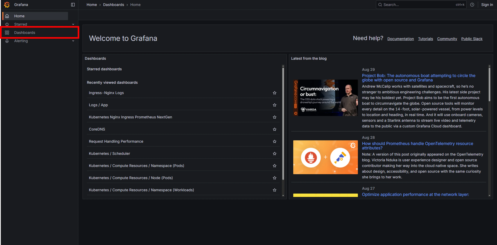
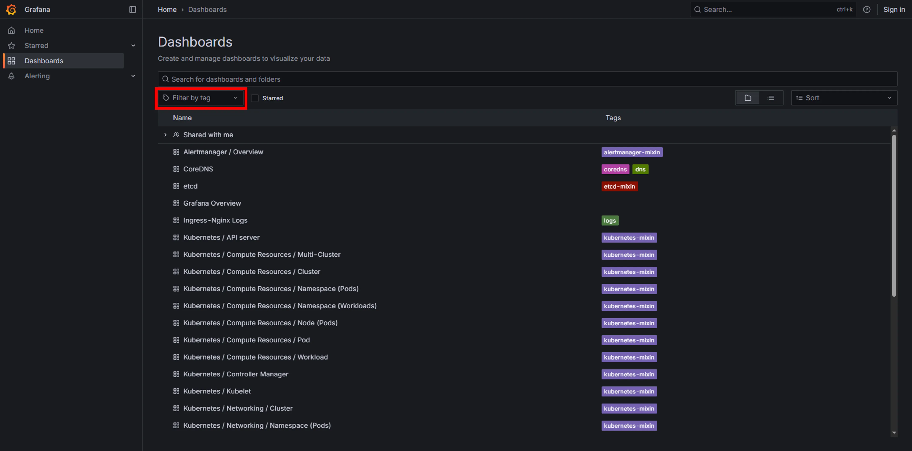
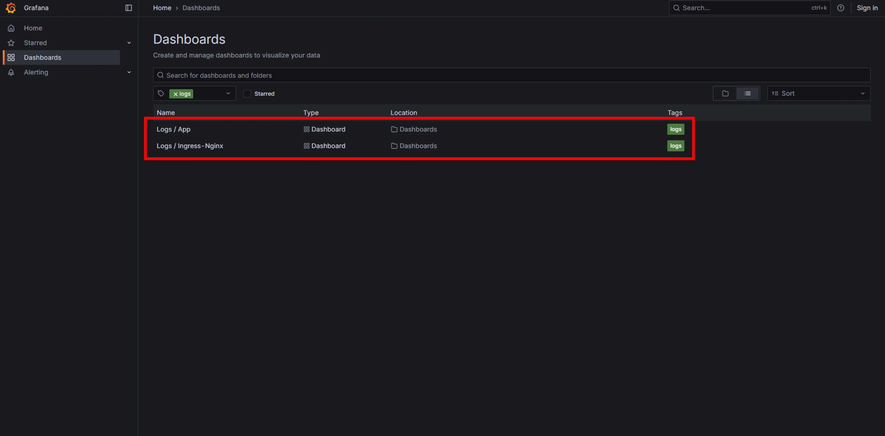
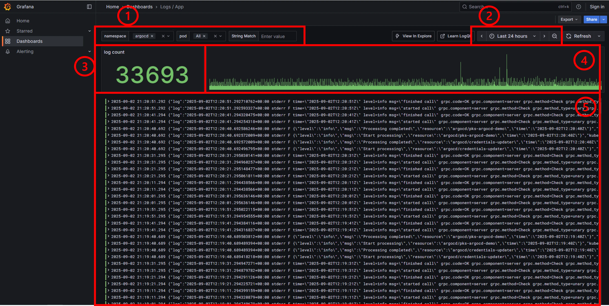
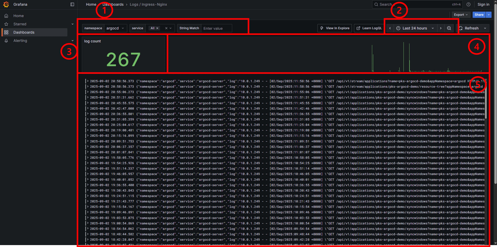

# PKS에서 내 애플리케이션 관찰하기

PKS(PoolC Kubernetes Service)는 Grafana를 이용한 모니터링 대시보드를 제공하여, 사용자가 배포한 애플리케이션의 로그를 쉽게 확인하고 분석할 수 있도록 돕습니다.

이 문서는 PKS에 간단한 웹 서버를 배포하고, Grafana 대시보드를 통해 해당 서버에서 발생하는 로그를 실시간으로 확인하는 과정을 안내합니다.

## 목차
- [Disclaimer](#disclaimer)
- [실습 환경 구성](#0-실습-환경-구성)
  - [클러스터 접속 테스트](#클러스터-접속-테스트)
  - [모니터링 페이지 접속 테스트](#모니터링-페이지-접속-테스트)
- [Quick Start](#quick-start)
  - [Step 1. Nginx 배포하기](#step-1-nginx-배포하기)
  - [Step 2. 로그 생성 및 확인하기](#step-2-로그-생성-및-확인하기)
  - [Step 3. 실습 완료 후 모든 자원 삭제하기](#step-3-실습-완료-후-모든-자원-삭제하기)
- [What's Next?](#whats-next)
- [부록](#부록)
  - [Grafana가 무엇인가요?](#grafana가-무엇인가요)
  - [애플리케이션 로그와 access 로그의 차이](#애플리케이션-로그와-access-로그의-차이)

## Disclaimer

이 문서는 **PKS의 모니터링 기능을 빠르게 사용해보는 데에 초점**이 맞춰져 있습니다. Grafana의 모든 기능이나 로그 파이프라인의 상세한 동작 원리는 다루지 않습니다.

## 0. 실습 환경 구성

본격적인 실습에 앞서, PKS 클러스터와 모니터링 페이지에 정상적으로 접속할 수 있는지 확인해봅시다.

### 클러스터 접속 테스트
클러스터가 정상적으로 접속이 가능한 상태라면, 다음의 명령어가 오류 없이 실행되어야 합니다.
```console
$ kubectl get namespaces
NAME                 STATUS   AGE
argocd               Active   62d
cilium-secrets       Active   79d
default              Active   79d
ingress-nginx        Active   78d
kube-node-lease      Active   79d
kube-public          Active   79d
kube-system          Active   79d
kyverno              Active   13d
local-path-storage   Active   18d
monitoring           Active   74d
pks-argocd-demo      Active   11d
poolc-system         Active   13d
poolc-users          Active   33h
```

> [!WARNING]
> 위 명령어가 제대로 실행되지 않는다면 PKS 클러스터와의 연결이 불안정한 상태입니다.
> 
> 사용자 가이드 [README](./README.md)를 통해 연결을 진행 한 후에 실습 진행해주세요.

### 모니터링 페이지 접속 테스트
모니터링 페이지는 Grafana로 구성되어 있습니다.

아래의 링크를 통해 정상적으로 접속되는지 확인해 주세요.

[http://mon.dev.poolc.org](http://mon.dev.poolc.org)

> [!WARNING]
> 페이지에 접속할 수 없다면 교내망에 연결되어 있지 않았을 가능성이 높습니다.
> 
> 교내 네트워크를 사용하거나 YSVPN을 활성화했는지 다시 한번 확인해주세요.

## Quick Start

이제 간단한 Nginx 웹 서버를 배포하고 로그를 확인하며 PKS의 모니터링 기능을 체험해봅시다!

### Step 1. Nginx 배포하기

> [!CAUTION]
> Windows의 CMD, Powershell 환경에서는 아래 스크립트가 제대로 동작하지 않을 수 있습니다. 
> 
> Git Bash나 WSL 환경에서 진행하시는 것을 권장합니다.

1. 아래 스크립트 전체를 복사하여 텍스트 에디터에 붙여넣어주세요.

2. `NAMESPACE_NAME` 을 원하는 값으로 수정해주세요. (알파벳 소문자와 하이픈만 사용 가능. ex. coffee)

3. `SUBDOMAIN_NAME`을 원하는 값으로 수정해주세요. (알파벳 소문자와 하이픈만 사용 가능. ex. coffe)

4. 수정이 완료된 스크립트를 터미널에 그대로 붙여넣어 실행해주세요.

> [!NOTE]
> PKS에 배포되는 워크로드들은 dev.poolc.org의 하위 도메인을 **서로 겹치지 않는 선에서** 자유롭게 사용할 수 있습니다. `kubectl get ingress --all-namespaces` 명령어로 현재 사용 중인 도메인을 확인하고, 중복되지 않는 이름을 사용해주세요.

``` Bash
NAMESPACE_NAME="my-monitoring-test"
SUBDOMAIN_NAME="my-monitoring-test"

# 1. Namespace 생성
kubectl apply -f - <<EOF
apiVersion: v1
kind: Namespace
metadata:
  name: $NAMESPACE_NAME
EOF

# 2. 해당 Namespace 하위에 리소스를 생성할 권한이 부여될 때까지 대기
echo "Waiting for RoleBinding to be created..."
while ! kubectl auth can-i create pods -q -n "$NAMESPACE_NAME"; do
  sleep 1
done
echo "RoleBinding created. Proceeding with resource creation."

# 3. Nginx 관련 리소스(Deployment, Service, Ingress) 생성
kubectl apply -f - <<EOF
---
apiVersion: apps/v1
kind: Deployment
metadata:
  name: nginx-deployment
  namespace: $NAMESPACE_NAME
spec:
  replicas: 1
  selector:
    matchLabels:
      app: nginx
  template:
    metadata:
      labels:
        app: nginx
    spec:
      containers:
        - name: nginx
          image: nginx:latest
          ports:
            - containerPort: 80
          command: ["/bin/sh", "-c"]
          args:
            - |
              echo '<html>
              <head><title>PKS Monitoring Demo</title></head>
              <body>
                <h1>안녕하세요! 모니터링 실습입니다.</h1>
              </body>
              </html>' > /usr/share/nginx/html/index.html && \
              nginx -g 'daemon off;'
---
apiVersion: v1
kind: Service
metadata:
  name: nginx-service
  namespace: $NAMESPACE_NAME
spec:
  selector:
    app: nginx
  ports:
    - port: 80
      targetPort: 80
---
apiVersion: networking.k8s.io/v1
kind: Ingress
metadata:
  name: nginx-ingress
  namespace: $NAMESPACE_NAME
spec:
  ingressClassName: nginx
  rules:
    - host: $SUBDOMAIN_NAME.dev.poolc.org
      http:
        paths:
          - path: /
            pathType: Prefix
            backend:
              service:
                name: nginx-service
                port:
                  number: 80
EOF
```

4. 다음의 명령어를 사용해서 리소스가 잘 생성되었는지 확인해봅시다.

```console
$ kubectl get all -n $NAMESPACE_NAME
NAME                                    READY   STATUS    RESTARTS   AGE
pod/nginx-deployment-698d9748f5-g64dx   1/1     Running   0          23m

NAME                    TYPE        CLUSTER-IP       EXTERNAL-IP   PORT(S)   AGE
service/nginx-service   ClusterIP   10.105.107.233   <none>        80/TCP    23m

NAME                               READY   UP-TO-DATE   AVAILABLE   AGE
deployment.apps/nginx-deployment   1/1     1            1           23m

NAME                                          DESIRED   CURRENT   READY   AGE
replicaset.apps/nginx-deployment-698d9748f5   1         1         1       23m
```

### Step 2. 로그 생성 및 확인하기

이제 배포된 웹 서버에 접속하여 로그를 발생시키고, Grafana 대시보드에서 직접 확인해볼 차례입니다.

#### 로그 생성하기

먼저, 아래 명령어를 실행하거나 웹 브라우저에서 $SUBDOMAIN_NAME.dev.poolc.org 주소로 접속하여 로그를 생성해주세요. 여러 번 접속하면 더 많은 로그를 확인할 수 있습니다.

```
curl $SUBDOMAIN_NAME.dev.poolc.org
```

#### Grafana에서 로그 확인하기

1. 모니터링 페이지([http://mon.dev.poolc.org](http://mon.dev.poolc.org))에 접속한 뒤, 좌측 메뉴에서 **Dashboards**를 클릭합니다.

<p align="center">
  
</p>

2. "Filter by tags" 기능으로 `logs` 태그를 필터링합니다.

<p align="center">
    
</p>

<p align="center">
    
</p>

3. Logs / App 대시보드

이 대시보드는 Pod 내부에서 발생하는 로그(stdout/stderr)를 보여줍니다.
- `namespace` 필터에서 방금 생성한 네임스페이스를 선택하면, 컨테이너가 출력하는 로그를 확인할 수 있습니다.

<p align="center">
    
    <span> "argocd"를 네임스페이스로 사용한 예시</span>
</p>

**① Label Filters**: 로그를 필터링하는 데 사용되는 레이블 선택 창입니다. `namespace`, `pod` 등의 값을 지정하여 원하는 로그만 선택적으로 조회할 수 있습니다.

**② Time Range**: 조회할 로그의 시간 범위를 설정하는 기능입니다.

**③ Log Count & Timeline**: 선택된 시간 범위와 필터에 해당하는 전체 로그의 수와 시간대별 발생 빈도를 그래프로 나타냅니다.

**④ Log Entries**: 필터링된 로그 내용이 시간 순서대로 표시되는 영역입니다.

**⑤ Log Details**: 개별 로그 라인을 펼쳐 상세 정보를 확인할 수 있는 기능입니다.

---

4. Logs / Ingress-Nginx 대시보드

이 대시보드는 PKS 클러스터로 들어오는 Ingress-Nginx의 [access log](#애플리케이션-로그와-access-로그의-차이) 를 보여줍니다.

- `namespace`와 `service` 필터를 알맞게 선택하면, 우리가 생성한 웹 서버($SUBDOMAIN_NAME.dev.poolc.org)로 들어온 요청 기록을 확인할 수 있습니다.

<p align="center">
    
    <span> "argocd"를 네임스페이스로 사용한 예시</span>
</p>

**① Label Filters**: Ingress-Nginx 로그를 필터링하기 위한 레이블 선택 창입니다. 트래픽이 전달된 `namespace`와 `service`를 기준으로 특정 서비스의 접근 기록만 조회할 수 있습니다.

**② Time Range**: 조회할 로그의 시간 범위를 설정하는 기능입니다.

**③ Log Count & Timeline**: 해당 조건으로 조회된 전체 access log의 수와 시간대별 요청 빈도를 그래프로 나타냅니다.

**④ Log Entries**: 필터링된 access log의 상세 내용이 시간 순으로 표시됩니다.

**⑤ Log Details**: 개별 로그 라인을 펼쳐 상세 정보를 확인할 수 있는 기능입니다.

---

### Step 3. 실습 완료 후 모든 자원 삭제하기

실습이 끝났다면, 아래 명령어를 실행하여 생성했던 모든 리소스를 한 번에 삭제할 수 있습니다. `$NAMESPACE_NAME` 부분은 Step 1에서 지정한 이름으로 변경해주세요.
```Bash
kubectl delete namespace $NAMESPACE_NAME
```

## What's Next?

TODO: 각 문서가 완성되면 링크 추가

- Argo CD를 활용해 GitOps 기반의 개발 프로세스 확립하기

## 부록
### Grafana가 무엇인가요?
Grafana는 다양한 데이터 소스로부터 시계열 데이터를 가져와 시각화해주는 오픈소스 대시보드 툴입니다. PKS에서는 클러스터의 각종 로그와 메트릭 정보를 Grafana 대시보드를 통해 제공하여, 사용자가 자신의 워크로드 상태를 직관적으로 파악할 수 있도록 돕습니다.

### 애플리케이션 로그와 access 로그의 차이
- **애플리케이션 로그 (Logs / App)**: 컨테이너 내부에서 실행되는 애플리케이션이 직접 출력하는 로그입니다. `console.log`, `print` 문 등으로 출력하는 내용들이 여기에 해당하며, 애플리케이션의 내부 동작을 디버깅하는 데 주로 사용됩니다.
- **access 로그 (Logs / Ingress-Nginx)**: 클러스터 외부에서 내부의 서비스로 들어오는 모든 HTTP 요청에 대한 기록입니다. 어떤 사용자가 언제, 어떤 주소로, 어떤 메소드(GET, POST 등)를 사용해 접속했는지 등의 정보를 담고 있어 트래픽 분석이나 접근 제어에 유용합니다.